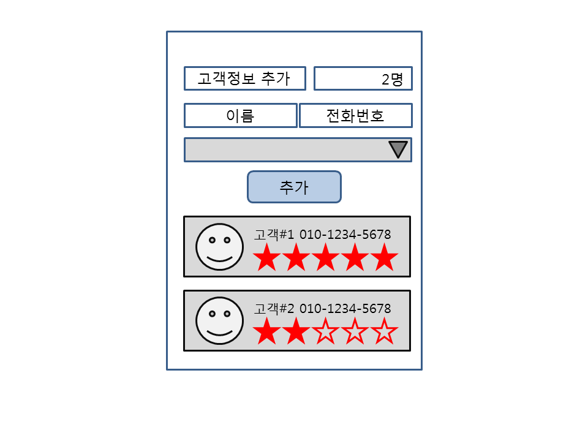

**P369**    [실습코드](https://github.com/minkyungcho/TIL/tree/master/Android/day05/P369)

**핸드폰 전화 가능하게 하기**

app/manifests/AndroidManifest.xml 에 추가

```xml
<uses-permission android:name="android.permission.CALL_PHONE" />
```

```java
// 권한 부여
String[] Permissions = {
            Manifest.permission.CALL_PHONE,
    };
ActivityCompat.requestPermissions(this, Permissions, 101);
 // 버튼 클릭했을때 전화 되는지 안되는지
    public void onClick(View v) {
        int permission = PermissionChecker.checkSelfPermission(this, Manifest.permission.CALL_PHONE);
        Intent intent = new Intent();
        if(permission == PackageManager.PERMISSION_GRANTED){
            intent = new Intent(Intent.ACTION_CALL, Uri.parse("tel:010-6737-0122"));
            startActivity(intent);
        }else{
            Toast.makeText(this, "권한부여가 안되었습니다.", Toast.LENGTH_SHORT).show();
            return;
        }
    }
```


#### 리스트뷰

어댑터에 데이터를 넣어서 그 어댑터를 리스트뷰에 붙인다.

**리스트뷰에 이벤트 붙이기**

해당하는 객체를 만들어서 사용

app/java/com.example.p427 우클릭 - new - java class - item.java 생성

우클릭 - generate - constructor/getter and setter 생성

**P427**    [실습코드](https://github.com/minkyungcho/TIL/tree/master/Android/day05/P427)

```java
// 리스트뷰 생성
listView = findViewById(R.id.listView);
listView.setOnItemClickListener(this);
// 리스트 클릭했을때 실행되는 함수
@Override
    public void onItemClick(AdapterView<?> adapterView, View view, int i, long l) {
        Item item = list.get(list.size()-i-1); // 데이터 거꾸로 출력중
        Toast.makeText(this, ""+item.getPhone(), Toast.LENGTH_SHORT).show();
        int permission = PermissionChecker.checkSelfPermission(this, Manifest.permission.CALL_PHONE);
        Intent intent = new Intent();
        if(permission == PackageManager.PERMISSION_GRANTED){
            intent = new Intent(Intent.ACTION_CALL, Uri.parse("tel:"+"010-6737-0122"));
            startActivity(intent);
        }else{
            Toast.makeText(this, "권한부여가 안되었습니다.", Toast.LENGTH_SHORT).show();
            return;
        }
    }
// 리스트를 adapter에 붙인다.
    class ItemAdapter extends BaseAdapter {
        ArrayList<Item> alist;
        public ItemAdapter(){
        }
        public ItemAdapter(ArrayList<Item> alist) {
            this.alist = alist;
        }
        public void addItem(Item item){
            alist.add(item);
            list = alist;
        }
        @Override
        public int getCount() {
            return alist.size();
        }
        @Override
        public Object getItem(int i) {
            return alist.get(i);
        }
        @Override
        public long getItemId(int i) {
            return i;
        }
        @Override
        public View getView(int i, View view, ViewGroup viewGroup) {
            View myview = null;
            LayoutInflater inflater = (LayoutInflater) getSystemService(Context.LAYOUT_INFLATER_SERVICE);
            myview = inflater.inflate(R.layout.layout, container,true);
            ImageView iv = myview.findViewById(R.id.imageView);
            TextView tv1 = myview.findViewById(R.id.textView);
            TextView tv2 = myview.findViewById(R.id.textView2);
//            iv .setImageResource(alist.get(i).getImgId());
//            tv1.setText(alist.get(i).getName()); //
//            tv2.setText(alist.get(i).getPhone());
            iv.setImageResource(alist.get(alist.size()-i-1).getImgId()); // 거꾸로 나열
            tv1.setText(alist.get(alist.size()-i-1).getName()); 
            tv2.setText(alist.get(alist.size()-i-1).getPhone());
            return myview;
        }
    }
	// button누르면 리스트에 새로운 item 추가
    public void clickBt2(View view){
        itemAdapter.addItem(new Item("김말자", "010-9876-5432", R.mipmap.ic_launcher));
        itemAdapter.notifyDataSetChanged(); // 11번 돈다. 새로 refresh 해워야함.
    }
	// button 누르면 어뎁터에 데이터 넣고 어뎁터를 리스트에 붙인다.
    public void clickBt(View view){
        getData();
        itemAdapter = new ItemAdapter(list);
        listView.setAdapter(itemAdapter);
    }
```


#### 스피너

**스피너에 이벤트 붙이기 & Rating으로 별점주기**

**P436**    [실습코드](https://github.com/minkyungcho/TIL/tree/master/Android/day05/P436)

```java
// ratingbar 선언
RatingBar ratingBar;
// adaptor 생성
ArrayAdapter<Integer> adapter = new ArrayAdapter<>(this, android.R.layout.simple_spinner_item,list);        adapter.setDropDownViewResource(android.R.layout.simple_spinner_dropdown_item); // 손가락으로 화살표 눌렀을때 밑으로 쭈르륵 떨어지는 화면
spinner.setAdapter(adapter);
spinner.setOnItemSelectedListener(this);
// rating bar 속성 설정
ratingBar = findViewById(R.id.ratingBar);
        ratingBar.setRating(0);
        ratingBar.setNumStars(5);
        ratingBar.setMax(5);
        ratingBar.setStepSize(1);
// spinner 클릭하면 해당값 img로 보여주고 별점 하나씩 올라간다.
@Override
    public void onItemSelected(AdapterView<?> adapterView, View view, int i, long l) {
        Integer imgcode = list.get(i);
        imageView.setImageResource(imgcode);
        float temp = ratingBar.getRating()+1;
        ratingBar.setRating(temp);
    }
```

---

## WORKSHOP

**P440**    [실습코드](https://github.com/minkyungcho/TIL/tree/master/Android/day05/P440)

리스트뷰에 고객정보 추가하기




