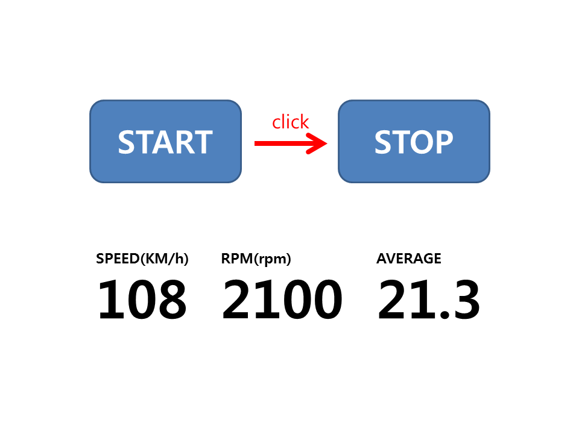

webview : 네이티브 앱에 일정영역에 웹브라우저를 붙이는 것

#### 08-3 앱 화면에 웹브라우저 넣기

**P458**    [실습코드](https://github.com/minkyungcho/TIL/tree/master/Android/day06/P458)

웹뷰에 자바스크립트 동작하게 해주기.

```java
webSettings.setJavaScriptEnabled(true);
```

보안 해제 AndroidManifest.xml 설정

```xml
<uses-permission android:name="android.permission.INTERNET"/>
```

**web 만들기 - eclipse**

서버 세팅 - tomcat 

new dynamic web projact - webview 생성 - web - finish

****

키보드 없애는 속성 추가

```xml
<activity android:name=".MainActivity" android:windowSoftInputMode="stateHidden>"
```

### 09 쓰레드와 핸들러 이해하기

#### 09-1 쓰레드 사용하기

서비스 : 눈에 보이지 않는 프로세스

프로세스 : 실제로 코드가 기계어로 바뀌어서 동작되고 있는것.

하나의 프로세스 안에서 동시에 일어났을때. 

cpu는 여유롭지만 메모리는 바쁘다. 

thread 내부 변수들은 변하면 안돼서 final로 설정

**P474**   [실습코드](https://github.com/minkyungcho/TIL/tree/master/Android/day06/P474)

**Runnable은 Thread처럼 사용**

onCreate : 첫번째 쓰레드. parent thread, mian thread

clickBt1,clickBt2 : 별도의 쓰레드 또 생성. 

서브 thread는 main thread를 제어할수 없다. => **runOnUiThread()**

```java
runOnUiThread(new Runnable() {
                    @Override
                    public void run() {
                        textView2.setText(temp +"");
                    }
                });
```


**P478**    [실습코드](https://github.com/minkyungcho/TIL/tree/master/Android/day06/P478)

서브쓰레드에서 메세지를 main쓰레드에 보낸다 => 메인에 **handler** 생성


#### 09-3 쓰레드로 메시지 전송하기

**P485**    [실습코드](https://github.com/minkyungcho/TIL/tree/master/Android/day06/P485)

서브쓰레드와 메인쓰레드 간 자유로운 왕래는 불가능

메시지를 받을곳에 **handler** 생성

원래 쓰레드 start하면 run이 호출됨. -> 쓰레드 객체만 생성 -> 객체에 값 넣기 


---

## WORKSHOP

**P488**    [실습코드](https://github.com/minkyungcho/TIL/tree/master/Android/day06/P488)

