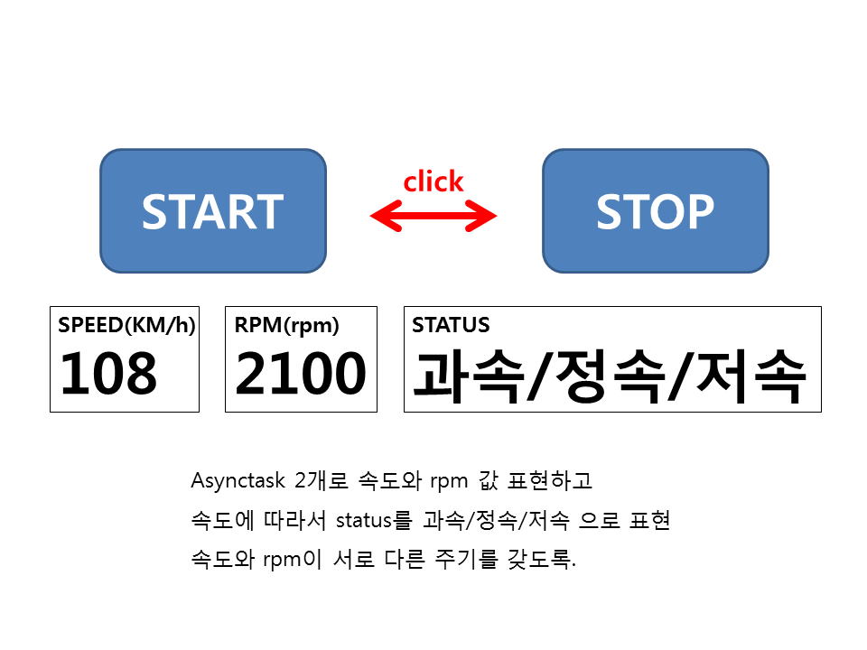

#### 09-4 AsyncTask 사용하기

핸들러로 복잡하게 작업하지 않고 간단하게 작업하는 방법

handler + thread 의 모습

서브thread와 메인thread에서 아울러져서 작업이 진행됨

**P490**

**AsyncTask<Integer, Integer, String>**

<input argument, thread 동작 상태, thread종료 후 return type>

```java
class SpeedTask extends AsyncTask<Integer,Integer, Integer>{
        // thread 동작 전
    	@Override
        protected void onPreExecute() {
            //super.onPreExecute();
        }
		// thread 동작되는 부분. 끝나면서 Integer return
        @Override
        protected Integer doInBackground(Integer... integers) {				
            for(int i=1; i<=10; i++){
                if(isCanceled()==true){
                    break; // thread 종료 되면 for문 break
                }
                publishProgress(i);
            }
            return i;
        }
		// thread에서 발생되고 있는 내용을 받아서 그때그때 처리
        @Override
        protected void onProgressUpdate(Integer... values) {
            //super.onProgressUpdate(values);
            // publishProgress(i); 의 i값이 values 배열로 들어온다.
            textView.setText(values[0].intValue()+"");
        }
		// thread 종료 후
        @Override
        protected void onPostExecute(Integer integer) {
            //super.onPostExecute(integer);
        }
    }
```

---

## WORKSHOP

**P499**    



**AsyncTask 두개 동시에 돌리는 방법**

```java
speedTask = new SpeedTask();
speedTask.execute();
rpmTask = new RpmTask();
rpmTask.executeOnExecutor(AsyncTask.THREAD_POOL_EXECUTOR); 
```


---

#### 10-3 웹으로 요청하기

**P511**

네트워크에 갔다 오는건 반드시 thread 사용해야함.

---

## WORKSHOP

**P535**