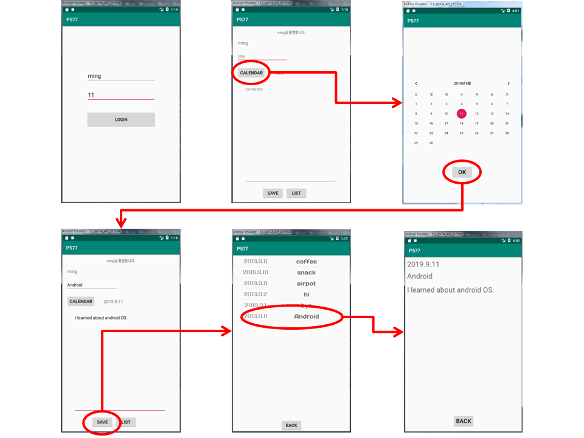

# 11 단말에 데이터베이스와 내용 제공자 만들기

안드로이드 단말이나 아이폰과 같은 스마트폰에서는 데이터베이스를 기본으로 제공하고 있기 때문에 앱이 단말에 데이터를 저장할때는 대부분 데이터베이스를 사용한다.

### 11-1 모바일 데이터베이스란?

데이터를 간단하게 저장할 때 : SharedPreferences 사용

많은 양의 데이터를 체계적으로 관리하려면 데이터베이스 필요

**P537**    [실습코드](https://github.com/minkyungcho/TIL/tree/master/Android/day08/P537)

로그인 실패 시, toast(‘로그인에 실패하였습니다.’)

로그인 성공 시, main activity 뜨면서 화면에 ‘OO님 환영합니다.’ 띄우기

### 11-4 데이터 조회하기

**P548**    [실습코드](https://github.com/minkyungcho/TIL/tree/master/Android/day08/P548)

### 11-5 내용 제공자 이해하기

내가 만든것을 다른 activity가 가져갈 수 있도록

A : 연락처 app

B : T 전화

B app이 기본 app A에 있는 데이터를 가져올 수 있음

---

## WORKSHOP

**P577**    [실습코드](https://github.com/minkyungcho/TIL/tree/master/Android/day08/P577)

**실행화면**

