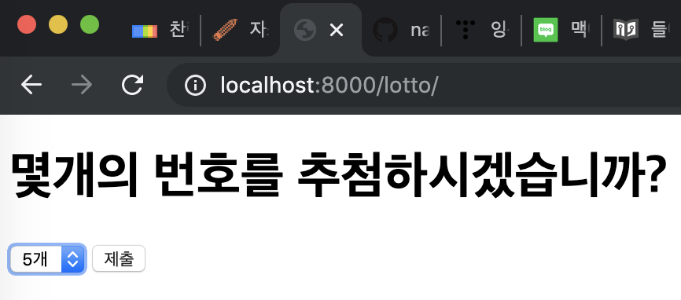
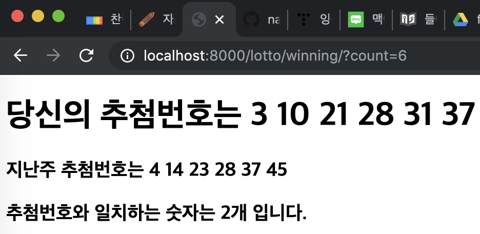
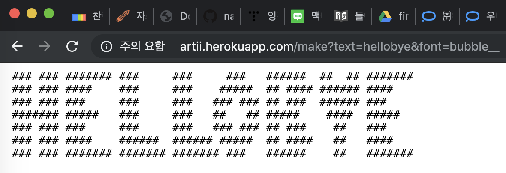
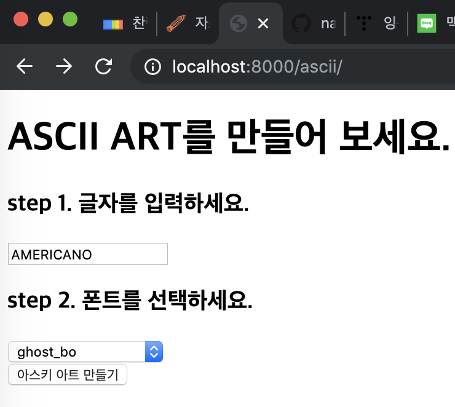
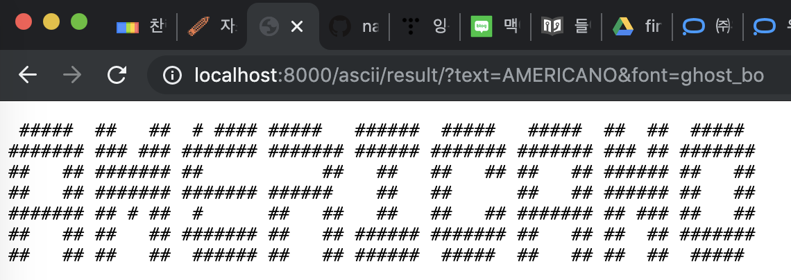
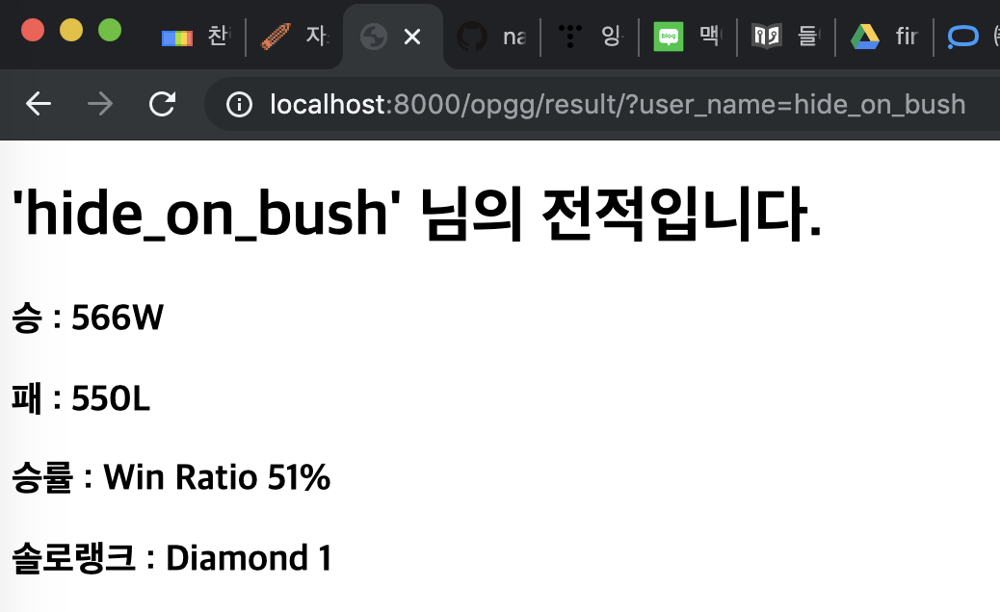

# Day5
- Django 시작하기
    - 프로젝트 만들기
        - 프로젝트 vs 어플리케이션(app)
        - MVC -> MVT
        - Model View Controller -> Model View(Controller) Template(View)

- Django
    - 시작하기
    - django-admin startproject "projectname"
    - cd "projectname"
    - python manage.py startapp "appname" (**MAC** : python3 manage.py startapp "appname")
    - django에서 app단위는 하나의 모델에 대한 모든 내용이 담겨있다.
    - 예를 들어 게시판을 만든다고 하면, Post라는 app을 만들어서 그 안에서 모든 내용을 처리한다.

- 로또번호 생성기 + 이번주 당첨 번호 체크 + 번호를 몇개나 뽑을지(자동/반자동)
    - 메인페이지 : 번호를 몇개 뽑을지 선택, 생성버튼 **'/lotto'**
    - 결과페이지 : 랜덤으로 뽑힌 번호 출력, 뽑힌 번호와 가장최근 당첨번호 비교 **'/lotto/winning'**
- 신이 나를 만들때

---
## 로또 만들기

### app 만드는 순서
1. `python3 manage.py startapp`
2. `settings.py`의 `INSTALLED_APPS`에 만든 app을 추가
3. 만든 app 폴더에 가서 `views.py` 파일에 함수 등록
4. 해당 함수의 결과로 return 할 template 선언
5. 위 template 파일 만들기
6. `urls.py`에 등록된 함수 연결

~~~ command
$ django-admin startproject day5
$ cd day5
$ python3 manage.py startapp lotto # 로또 app 생성
~~~
- settings.py, urls.py, view.py
- urls.py : 어느 view의 어느 method로 가는지 설정해줌
~~~ python
# day5/settings.py
INSTALLED_APPS = [
    'lotto',
    ...
]
~~~
~~~ python
# lotto/views.py
# Create your views here.
def lotto(request):
    return render(request, 'lotto.html')
def winning(request):
    return render(request, 'winning.html')
~~~
> flask와는 다르게 django에서는 매개변수로 request를 가져간다. 또한 render를 return해야한다.
- 어떤 주소로 받을지, 주소로 요청을 받으면 어떤 함수를 쓸지?
~~~ python
# day5/urls.py
from lotto import views # lotto로부터 views를 import함
urlpatterns = [
    path('admin/', admin.site.urls),
    path('lotto/', views.lotto),
    path('lotto/winning/', views.winning)
]
~~~
- 메인페이지에서 번호 몇개뽑을지 선택하는 틀 만들기
~~~ html
<!-- lotto.html -->
<!DOCTYPE html>
<html lang="ko">
<head>
    <meta charset="UTF-8">
    <meta name="viewport" content="width=device-width, initial-scale=1.0">
    <meta http-equiv="X-UA-Compatible" content="ie=edge">
    <title>Document</title>
</head>
<body>
    <h1>몇개의 번호를 추첨하시겠습니까?</h1>
    <form action="/lotto/winning">
        <select name="count">
            <option value="1">1개</option>
            <option value="2">2개</option>
            <option value="3">3개</option>
            <option value="4">4개</option>
            <option value="5">5개</option>
            <option value="6">6개</option>
        </select>
        <input type="submit">
    </form>
</body>
</html>
~~~
- url과 페이지 확인

- 로또번호 생성기 만들기
~~~ python
# views.py
from django.shortcuts import render
import random, requests
from bs4 import BeautifulSoup

# Create your views here.
def lotto(request):
    return render(request, 'lotto.html')

def winning(request):
    # 1. 1~45까지의 숫자 중에 n개의 숫자를 랜덤추출
    # 1-1. 1~45까지의 번호를 가진 배열을 만든다.
    num_list = list(range(1,46))
    num_count = request.GET['count'] # count 값을 string으로 인식함
    # 1-2. 해당 배열에서 count만큼의 숫자를 샘플링. 
    result = random.sample(num_list, int(num_count)) # string값 int형으로 변환
    result.sort() # 숫자 정렬
    # 2. 로또 당첨번호 공개 사이트로 가서
    # - 몇회차인지, 언제 당첨번호인지, 1등 금액
    url = 'https://www.dhlottery.co.kr/gameResult.do?method=byWin'
    response = requests.get(url)
    html = BeautifulSoup(response.text, 'html.parser')
    winning_numbers = html.select('div.win span')
    winning_count = 0
    winning_list = []
    for number in winning_numbers:
        # result list 변수에 number가 포함되어 있나요?
        winning_list.append(int(number.text))
        if int(number.text) in result:
            winning_count += 1
    return render(request, 'winning.html', {'result': result, 'winning_list': winning_list, 'winning_count': winning_count})
~~~
> **range** 범위를 만들어주는 모듈
> 매개변수 1개일때는 0부터 해당숫자-1까지, 두개일때는 시작숫자와 끝숫자-1까지
~~~ html
<!-- lotto.html -->
<!DOCTYPE html>
<html lang="en">
<head>
    <meta charset="UTF-8">
    <meta name="viewport" content="width=device-width, initial-scale=1.0">
    <meta http-equiv="X-UA-Compatible" content="ie=edge">
    <title>Document</title>
</head>
<body>
    <h1>몇개의 번호를 추첨하시겠습니까?</h1>
    <form action="/lotto/winning">
        <select name="count">
            <option value="1">1개</option>
            <option value="2">2개</option>
            <option value="3">3개</option>
            <option value="4">4개</option>
            <option value="5">5개</option>
            <option value="6">6개</option>
        </select>
        <input type="submit">
    </form>
</body>
</html>
~~~
~~~ html
<!-- winning.html -->
<!DOCTYPE html>
<html lang="ko">
<head>
    <meta charset="UTF-8">
    <meta name="viewport" content="width=device-width, initial-scale=1.0">
    <meta http-equiv="X-UA-Compatible" content="ie=edge">
    <title>Document</title>
</head>
<body>
    <h1>당신의 추첨번호는
    
        {{num}}
    
    </h1>
    <h3>지난주 추첨번호는
    
        {{num}}
    
    </h3>
    <h3>추첨번호와 일치하는 숫자는 {{winning_count}}개 입니다.</h3>
</body>
</html>
~~~
- 구현 화면

---
## ASCII ART
- ascii art란?
[ascii art exam url][http://artii.herokuapp.com/make?text=hellobye&font=bubble__]
![결과 화면]
[font list 링크][http://artii.herokuapp.com/fonts_list]

- ascii app 생성
~~~ command
$ python3 manage.py startapp ascii
~~~
~~~ python
# settings.py
INSTALLED_APPS = [
    'lotto',
    'ascii'
]
~~~
~~~ python
# urls.py
# from lotto import views
# from ascii import views
from lotto import views as lotto_views
from ascii import views as ascii_views
urlpatterns = [
    path('admin/', admin.site.urls),
    path('ascii/', ascii_views.ascii),
    path('ascii/result/', ascii_views.result)
]
~~~
- templates 폴더에 ascii.html, result.html 생성
~~~ html
<!-- templates/ascii.html -->
<!DOCTYPE html>
<html lang="ko">
<head>
    <meta charset="UTF-8">
    <meta name="viewport" content="width=device-width, initial-scale=1.0">
    <meta http-equiv="X-UA-Compatible" content="ie=edge">
    <title>Document</title>
</head>
<body>
    <h1>ASCII ART를 만들어 보세요.</h1>
    <form action="/ascii/result">
        <h3>step 1. 글자를 입력하세요.</h3>
        <input type="text" name="text">
        <h3>step 2. 폰트를 선택하세요.</h3>
        <select name="font">
            
                <option value="{{ font }}">{{ font }}</option>
            
        </select>
         
        <input type="submit" value="아스키 아트 만들기">
    </form>
</body>
</html>
~~~
~~~ html
<!-- templates/result.html -->
<!DOCTYPE html>
<html lang="ko">
<head>
    <meta charset="UTF-8">
    <meta name="viewport" content="width=device-width, initial-scale=1.0">
    <meta http-equiv="X-UA-Compatible" content="ie=edge">
    <title>Document</title>
</head>
<body>
    <pre>{{ result }}</pre>
</body>
</html>
~~~

- 구현 화면

---
## Fake OP.GG 만들기
~~~ python
# settings.py
INSTALLED_APPS = [
    'opgg'
]
~~~
~~~ python
# urls.py
from opgg import views as opgg_views
urlpatterns = [
    path('opgg/', opgg_views.opgg),
    path('opgg/result/', opgg_views.result)
]
~~~
~~~ python
# views.py
from django.shortcuts import render
from bs4 import BeautifulSoup
import requests

# Create your views here.
def opgg(request):
    # 소환사명을 입력할 입력창을 만든다
    return render(request, 'opgg.html')

def result(request):
    # 실제 op.gg를 크롤링해서 입력된 소환사에 대한
    # 전적 정보를 가져온다.
    user_name = request.GET['user_name']
    url = f'https://www.op.gg/summoner/userName={user_name}'
    response = requests.get(url)
    html = BeautifulSoup(response.text, 'html.parser')
    # 소환사가 없거나 언랭인 경우
    if html.select_one('span.WinLose .wins') is None:
        result = {
            'msg': '소환사가 존재하지 않거나 언랭입니다.'
        }
    else:
        result = {
            'user_name': user_name,
            'win': html.select_one('span.WinLose .wins').text,
            'lose': html.select_one('span.WinLose .losses').text,
            'ratio': html.select_one('span.WinLose .winratio').text,
            'tier_rank': html.select_one('div.TierRank').text
        }
    # tier_rank = html.select_one('div.TierRank')
    # return render(request, 'result.html', {'user_name': user_name, 'tier_rank':tier_rank})
    return render(request, 'search_result.html', result)
~~~
~~~ html
<!-- templates/opgg.html -->
<!DOCTYPE html>
<html lang="ko">
<head>
    <meta charset="UTF-8">
    <meta name="viewport" content="width=device-width, initial-scale=1.0">
    <meta http-equiv="X-UA-Compatible" content="ie=edge">
    <title>Document</title>
</head>
<body>
    <h1>
        OP.GG
    </h1>
    <form action="/opgg/result">
        <input type="text" name="user_name">
        <input type="submit" value="검색">
    </form>
</body>
</html>
~~~
~~~ html
<!-- templates/search_result.html -->
<!DOCTYPE html>
<html lang="ko">
<head>
    <meta charset="UTF-8">
    <meta name="viewport" content="width=device-width, initial-scale=1.0">
    <meta http-equiv="X-UA-Compatible" content="ie=edge">
    <title>Document</title>
</head>
<body>
    <h1>{{ msg }}</h1>
    <h1>'{{ user_name }}' 님의 전적입니다.</h1>
    <h3>승 : {{ win }}</h3>
    <h3>패 : {{ lose }}</h3>
    <h3>승률 : {{ ratio }}</h3>
    <h3>솔로랭크 : {{ tier_rank }}</h3>
</body>
</html>
~~~
- 구현 화면

---
### tip
css selector