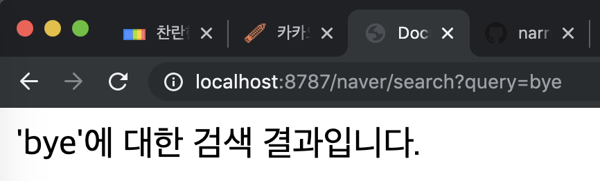

# Day5
- Django 시작하기
    - 프로젝트 만들기
        - 프로젝트 vs 어플리케이션(app)
        - MVC -> MVT
        - Model View Controller -> Model View(Controller) Template(View)

- Django
    - 시작하기
    - django-admin startproject "projectname"
    - cd "projectname"
    - python manage.py startapp "appname" (**MAC** : python3 manage.py startapp "appname")
    - django에서 app단위는 하나의 모델에 대한 모든 내용이 담겨있다.
    - 예를 들어 게시판을 만든다고 하면, Post라는 app을 만들어서 그 안에서 모든 내용을 처리한다.

- 로또번호 생성기 + 이번주 당첨 번호 체크 + 번호를 몇개나 뽑을지(자동/반자동)
    - 메인페이지 : 번호를 몇개 뽑을지 선택, 생성버튼 **'/lotto'**
    - 결과페이지 : 랜덤으로 뽑힌 번호 출력, 뽑힌 번호와 가장최근 당첨번호 비교 **'/lotto/winning'**
- 신이 나를 만들때

---
## 로또 만들기

~~~ command
$ django-admin startproject day5
$ cd day5
$ python3 manage.py startapp lotto # 로또 app 생성
~~~
- settings.py, urls.py, view.py
- urls.py : 어느 view의 어느 method로 가는지 설정해줌
~~~ python
# day5/settings.py
INSTALLED_APPS = [
    'lotto',
    ...
]
~~~
~~~ python
# day5/urls.py
from lotto import views # lotto로부터 views를 import함
~~~
~~~ python
# lotto/views/py
# Create your views here.
def lotto(request):

    return render(request, 'lotto.html')

def winning(request):

    return render(request, 'winning.html')
~~~
> flask와는 다르게 django에서는 매개변수로 request를 가져간다. 또한 render를 return해야한다.
~~~ python
urlpatterns = [
    path('admin/', admin.site.urls),
    path('lotto/', views.lotto),
    path('lotto/winning/', views.winning)
]
~~~
어떤 주소로 받을지, 주소로 요청을 받으면 어떤 함수를 쓸지?

#### app 만드는 순서
1. 'python3 manage.py startapp '
2. 'settings.py'의 'ㅅINSTALLED_APPS'에 만든 app을 추가
3. 만든 app 폴더에 가서 'views.py' 파일에 함수 등록
4. 해당 함수의 결과로 return 할 template 선언
5. 위 template 파일 만들기
6. 'urls.py'에 등록된 함수 연결

- 메인페이지에서 번호 몇개뽑을지 선택하는 틀 만들기
~~~ html
<!-- lotto.html -->
<!DOCTYPE html>
<html lang="ko">
<head>
    <meta charset="UTF-8">
    <meta name="viewport" content="width=device-width, initial-scale=1.0">
    <meta http-equiv="X-UA-Compatible" content="ie=edge">
    <title>Document</title>
</head>
<body>
    <h1>몇개의 번호를 추첨하시겠습니까?</h1>
    <form action="/lotto/winning">
        <select name="count">
            <option value="1">1개</option>
            <option value="2">2개</option>
            <option value="3">3개</option>
            <option value="4">4개</option>
            <option value="5">5개</option>
            <option value="6">6개</option>
        </select>
        <input type="submit">
    </form>
</body>
</html>
~~~

- 로또번호 생성기 만들기
~~~ python
# views.py

~~~
> **range** 범위를 만들어주는 모듈
> 매개변수 1개일때는 0부터 해당숫자-1까지, 두개일때는 시작숫자와 끝숫자-1까지