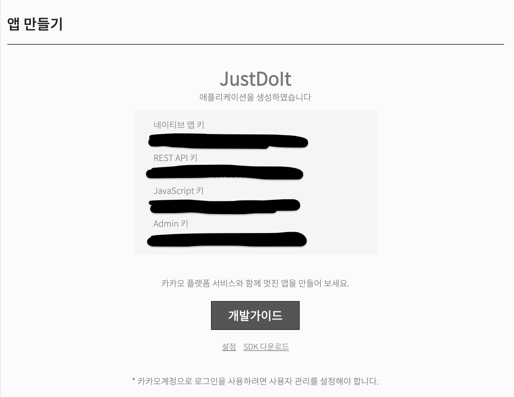
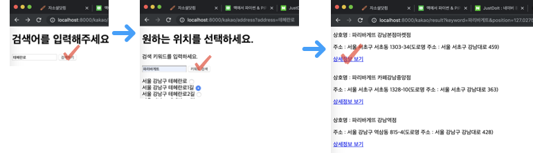

# Day6
REST API - 주소 검색
- 카카오 API 사용해보기
    - 지금까지는 정식적으로 API화가 되어 있지 않은 사이트를 크롤링해와서 데이터로 사용했음.(잘못 크롤링하거나, 사용하면 불법이 될 수도 있음)
    - 오늘은 정식적으로 제공하는 카카오API와 네이버 API를 활용해보자.
    - [카카오 개발자 페이지 가입해서 앱 만들기](https://developers.kakao.com/)
    - API key는 절!대!로 guthub이나 누군가 확인할 수 있는 공간에 공개하지 않습니다. (ex> AWS Credential Key가 공개될 경우 요금 폭탄)
    - 주소 검색하기 (gps_x, gps_y 좌표)
    - 키워드로 장소 검색하기
    - 공식 API 문서를 볼때 주의할 점
        - 요청방식과 요청을 보내야 할 주소(End-point)가 어떻게 되는지
        - 필수적인 파라미터가 있는지
        - 인증키를 어떠한 방식으로 보내야 하는지
---
## 카카오 API
### 1. 카카오 개발자 페이지 앱 만들기
- [앱 만들기](https://developers.kakao.com/)
- API key 생성 

### 2. django project 생성
- `apitest`라는 프로젝트 생성 후, 위치 변경
~~~ bash
$ django-admin startproject apites
$ cd apitest
~~~
- `kakao_api`라는 어플리케이션 생성
~~~ bash
$ python3 manage.py startapp kakao_api
~~~

### 3. 환경 설정
~~~ python
# settings.py
INSTALLED_APPS = [
    'kakao_api',
    ...
]
~~~
~~~ python
# urls.py
from kakao_api import views as kakao_views

urlpatterns = [
    path('admin/', admin.site.urls),
    # 주소 검색하는 페이지
    path('kakao/', kakao_views.main),
    # 주소 검색결과 + 키워드 입력
    path('kakao/address', kakao_views.find_address),
    # 키워드 검색 결과
    path('kakao/result', kakao_views.keyword_result)
]
~~~
~~~ python
# views.py
# Create your views here.
def main(request):
    # 주소 검색하는 페이지
    return render(request, 'kakao_main.html')

def find_address(request):
    # main에서 검색한 검색어를
    # 카카오 로컬 검색으로 검색한 결과를
    # 보여주는 페이지
    # + 키워드 입력하는 페이지
    return render(request, 'kakao_address.html', context)

def keyword_result(request):
    # 키워드를 입력하는 곳에서 입력한 키워드와
    # position(위도, 경도) 좌표를 추출해서
    # kakao API의 키워드 검색 api에 요청을 보낸다.
    return render(request, 'keyword_result.html', context)
~~~
### 4. templates / html 파일 
- `templates` 폴더 생성
- `kakao_main.html`, `kakao_address.html`, `keyword_result.html` 생성

### 5. views.py 함수 구현
~~~ python
# views.py
from django.shortcuts import render

import requests, json

# Create your views here.
def main(request):
    # 주소 검색하는 페이지
    return render(request, 'kakao_main.html')

def find_address(request):
    # main에서 검색한 검색어를
    # 카카오 로컬 검색으로 검색한 결과를
    # 보여주는 페이지
    # + 키워드 입력하는 페이지
    url = f'https://dapi.kakao.com/v2/local/search/address.json'
    key = 'REST API key'
    q = request.GET['address']
    params = {
        'query': q,
        'size': 30
    }
    headers = {
        'Authorization': f'KakaoAK {key}'
    }
    response = requests.get(url, params=params, headers=headers)
    address_data = json.loads(response.text)
    context = {
        'result': address_data["documents"]
    }
    return render(request, 'kakao_address.html', context)

def keyword_result(request):
    # 키워드를 입력하는 곳에서 입력한 키워드와
    # position(위도, 경도) 좌표를 추출해서
    # kakao API의 키워드 검색 api에 요청을 보낸다.
    keyword = request.GET['keyword']
    position = request.GET['position'] # position -> 127.04748663893264,37.50405828503332
    gps_x = position.split(',')[0]
    gps_y = position.split(',')[1]
    url = 'https://dapi.kakao.com/v2/local/search/keyword.json'
    key = 'REST API key'
    params = {
        'query': keyword,
        'x': gps_x,
        'y': gps_y,
    }
    headers = {
        'Authorization': f'KakaoAK {key}'
    }
    response = requests.get(url, params=params, headers=headers)
    # place_name, plce_url, road_address_name, address_name
    context = {
        'result': json.loads(response.text)["documents"]
    }
    return render(request, 'keyword_result.html', context)
~~~
- 구현 화면

---
#### REST API
[주소 검색 가이드 링크](https://developers.kakao.com/docs/restapi/local)

---
### tip
카카오가 정리 제일 잘 되어 있음 -> 카카오꺼 썼음 -> 플젝에서 사용하다가 버그같은거 발견했다 -> 이거 수정하면 좋을 것 같다 ㅎㅎㅎ