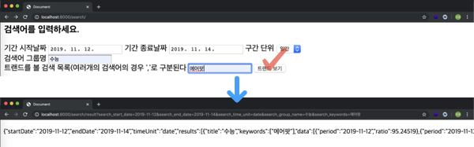

# Day7
> 19.11.14 목
---
- python 철학

- django 철학

~~~ python
a = [2,6,1,4,5,3]
a.sort()
a # a는 sort 된 배열로 바뀜
~~~
---
# todo
- naver api
- class
---
### Naver API 활용
1. 오픈 API 이용 신청
- [네이버 데이터랩](https://developers.naver.com/products/datalab/)
- [애플리케이션 등록](https://developers.naver.com/apps/#/register?defaultScope=datalab)
2. 가이드 
- [개발 가이드 보기](https://developers.naver.com/docs/datalab/search/)
---
## naver
~~~ bash
$ django-admin startproject naverapi
$ cd naverapi
$ python3 manage.py startapp search_trend
~~~
- 환경설정
~~~ python
# settings.py
INSTALLED_APPS = [
    'search_trend',
    ...
]
LANGUAGE_CODE = 'ko'
TIME_ZONE = 'Asia/Seoul'
# USE_I18N = True # Internationalization 국제화
# USE_L10N = True # Localization 현지화
USE_TZ = False # timezone 설정
~~~

- 구현화면

> [파라미터 참고](https://developers.naver.com/docs/datalab/search/#%ED%8C%8C%EB%9D%BC%EB%AF%B8%ED%84%B0)
> [내 어플리케이션](https://developers.naver.com/apps/#/list)
> `json.dumps(dict)` : JSON -> dict
---
## class 만들기
- `class` 폴더 생성
- `greeting`, `human.py` 생성

---

#### sqlite3
[다운로드](https://sqlitebrowser.org/dl/)
- **migration** : python 파일로 DB 구조를 만들 준비
- **migrate**(명령어) : 실제 DB에 반영됨 

### board module 활용
~~~ bash 
$ python manage.py shell
>>from boards.models import Board
>>Board
>>b1 = Board()
>>b1.title = '첫번째 제목'
>>b1.contents = '탄산수 시원해 좋아'
>>b1.creator = 'Ming'
>>print(b1)
>>print(b1.title)
>>print(b1.contents)
>>print(b1.creator)
>>b1.save() # save하기 전까지는 db에 저장되고 있지 않음.

>>b2 = Board()
>>b2.title = '오레오는 맛있어'
>>b2.contents = '오래오래 오레오 먹을래오'
>>b2.creator = 'Ming'
>>b2.save()

>>Board.objects.all() # Board의 전체 리스트? 뽑아내기
>>Board.objects.all()[0] # 한개 board만
>>Board.objects.filter(title='오레오는 맛있어') # filter도 Queryset
<QuerySet [<Board: Board object (2)>]>
>>Board.objects.filter(title='오레오는 맛있어')[0] # 배열 한개만 뽑아서 사용해야함
<Board: Board object (2)>
>>Board.objects.filter(title='오레오는 맛있어').first() # .last()
>>b1 = Board.objects.filter(title='오레오는 맛있어')[0]
>>print(b1.title) # b1 내용 바뀐것 확인
>>b_all = Board.objects.all()
>>for b in b_all:
...     print(b.title)
...
첫번째 제목
오레오는 맛있어
~~~

CRUD
- save()
- 
- 
- destroy()

하나씩 보여주는것 / 전체리스트 보여주는것
---
### tip
면접에서의 태도
- 부정적인 태도(학교에 대한..)는 지양하자
- 면접관과 대화한다는 마음가짐으로 면접에 임하자
- 태도, 인성, 기초지식
- ~~ 부분은 잘 모르지만 제가 아는건 ~~ 부분입니다. 앞서 말씀드린 것중에 잘못된 부분이 있으면 혹시 피드백 주시면 감사하겠습니다.

스타트업 [더팀스](https://www.theteams.kr/recruit) [원티드](https://www.wanted.co.kr/newintro)
- 하우스텝
- 미소
- 브랜디

Git
- 형상관리
- [git branch 활용](https://backlog.com/git-tutorial/kr/stepup/stepup2_2.html)

제니퍼소프트 
- 평점 4.5점..!
- java

백기선 
- [인프런 강의](https://www.inflearn.com/roadmaps/25) 평가 좋음
