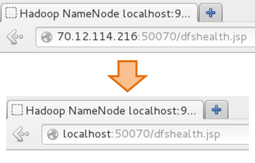
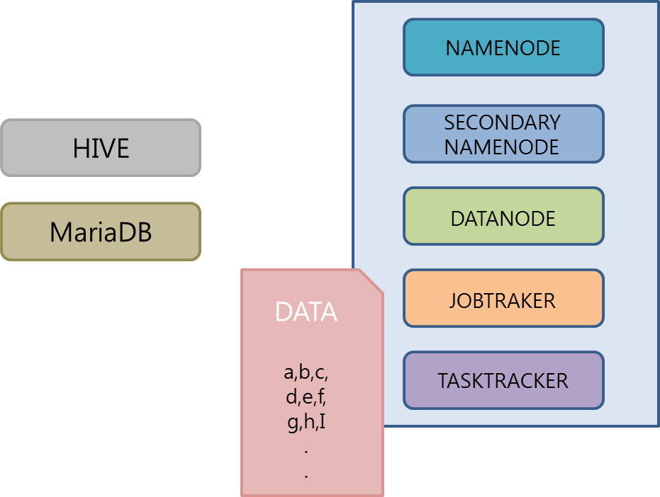
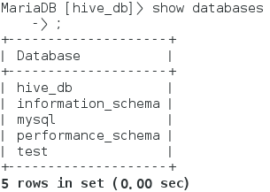
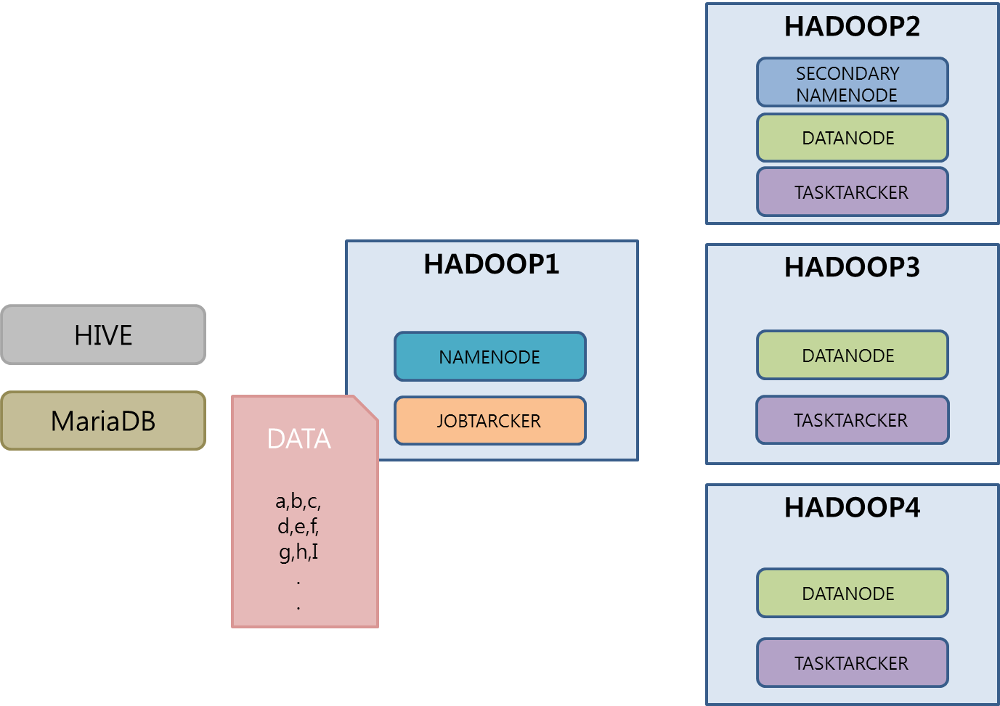

## HIVE

#### 가상분산모드에 hive 만들기

HADOOPSERVER2에 가상분산모드 hive 만들기

##### 웹 브라우저 url IP로 나오도록 변경하기

C:\Windows\System32\drivers\etc 의 hosts 맨 아래에 추가

```
70.12.114.216 hadoopserver2
```




## *part03 하둡 분산 파일 시스템*

HDFS(Hadoop Distributed File System)는 수십 테라바이트 또는 페타바이트 이상의 대용량 파일을 분산된 서버에 저장하고, 많은 클라이언트가 저장된 데이터를 빠르게 처리할 수 있게 설계된 파일 시스템이다.

### 3.1 HDFS 기초

대용량 파일 시스템

- DAS : 서버에 직접 연결된 storage.
- NAS : 여러개의 서버가 네트워크 통해서 공유
- SAN : 여러대 데이터 서버가 있는 네트워크 관리 시스템.

**hadoop**

- HDFS : 분산 저장 환경
- API : map reduce

설계 목표

- 장애 복구
- 스트리밍 방식의 데이터 접근
- 대용량 데이터 저장
- 데이터 무결성 : 데ㅌ이터 수정 불가능


### 3.2 HDSR 아키텍처

#### 블록 구조 파일 시스템

- 디스크 시크 타임
- 네임노드가 유지하는 메타데이터의 크기 감소
- 클라이언트와 네임노드 통신 속도 감소

##### 3.2.2 네임노드와 데이터노드

HDFS는 Master-Slave 아키텍처. 

**네임노드**

- 메다데이터 관리 : 네임노드는 파일 시스템을 유지하기 위한 메타데이터를 관리. 클라이언트에게 빠르게 응답하기 위해 전체 메타데이터를 메모리에 로딩해서 관리
- 데이터노드 모니터링 : 데이터노드는 네임노드에게 3초마다 하트비트 메시지를 전송.
- 블록 관리 : 장애가 발생한 데이터노드 발견하면 해당 데이터노드의 블록을 새로운 데이터노드로 복제.
- 클라이언트 요청 접수 : 클라이언트가 HDFS에 접근하려면 반드시 네임노드에 먼저 접속해야 한다. HDFS에 파일을 저장하는 경우 기존 파일의 저장 여부와 권한 확인의 절차를 거쳐서 저장을 승인. 

**데이터노드**

- 데이터노드는 클라이언트가 HDFS에 저장하는 파일을 로컬 디스크에 유지.
- 로컬디스트에 저장되는 파일
  - 실제 데이터가 저장되어 있는 로우 데이터
  - 체크섬이나 파일 생성 일자와 같은 메타데이터가 설정되어 있는 파일

##### 3.2.3 HDFS의 파일 저장

- 클라이언트가 네임노드에게 파일 저장을 요청하는 단계
- 클라이언트가 데이터노드에게 패킷을 전송하는 단계
- 클라이언트가 파일 저장을 완료하는 단계

##### 보조네임노드

eidtlog : 네임노드 변경 이력이 log로 쌓인다

fsimage : 네임노드의 최신상태 정보

클라이언트가 파일요청하는 대상은 namenode : 

파일 읽시/쓰기에 대한 요청은 cluster


#### 3.3 HDFS 명령어

파일 목록 보기

```
hadoop fs -ls
```

파일 용량 확인

```
hadoop fs -dus
```

디렉토리 생성

```
hadoop fs -mkdir mydir
hadoop fs -mkdir /mydir
```

파일 복사

```
hadoop fs -put anaconda-ks.cfg /mydir  
```

삭제

```
hadoop fs -rmr /mydir
```


## *part04 맵리듀스 시작하기*

맵리듀스는 HDFS에 저장된 파일을 분산 배치 분석을 할 수 있게 도와주는 프레임워크.

### 4.1 맵리듀스의 개념

```
hadoop jar hadoop-examples-1.2.1.jar wordcount /data/input /data/output
```

# V. 하둡 에코시스템 P.564

저장되어 있는 자료를 분석하기 위해



#### *step00 필요 파일 확인*

**HADOOPSERVER2 에서 작업**

- mysql
  - 리눅스 책 p.555~560 mysql 설치
  - mariadb-java-client-1.3.5.jar
- hive
  - apache-hive-1.0.1-bin.tar.gz (http://archive.apache.org/dist/hive/hive-1.0.1/)

#### *step01 Mysql에 hive 등록*

- mysql로 바로 접속

  ```
  mysql -u root -p mysql
  ```

- localhost에서 접속하는 hive에게 권한을 다 주겠다.

  ```
  [mysql] > grant all privileges on *.* to 'hive'@'localhost' identified by '111111';
  [mysql] > flush privileges;
  ```

- hive_db 만들고 권한을 hive에게 다 주겠다.

  ```
  [mysql] > create database hive_db;
  [mysql] > grant all privileges on hive_db.* to 'hive'@'%' identified by '111111' with grant option;
  [mysql] > grant all privileges on hive_db.* to 'hive'@'localhost' identified by '111111' with grant option;
  [mysql] > flush privileges;
  [mysql] > commit;
  [mysql] > exit;
  ```

- user의 host 검색

  ```
  [mysql] > select user,host from user;
  ```

  

- hive로 접속

  ```
  # mysql -u hive -p hive_db
  [hive_db] > show databases;
  ```

  

#### *sept02 HIVE 세팅*

- hive 압축 풀고 hive로 이름 변경하고 /etc로 옮기기

  ```
  tar vxf apache-hive-1.0.1-bin.tar.gz 
  mv apache-hive-1.0.1-bin hive
  cp -r hive /etc
  ```

- /etc/profile 수정

  ```
  HIVE_HOME=/etc/hive
  export JAVA_HOME CLASSPATH TOMCAT_HOME HADOOP_HOME HADOOP_HOME
  PATH=.:$JAVA_HOME/bin:$TOMCAT_HOME/bin:$HADOOP_HOME/bin:$HIVE_HOME/bin:$PATH
  ```

  ```
  . /etc/profile
  ```

- /etc/hive/conf 에 hive-site.xml 생성

	```
<?xml version="1.0"?>
<?xml-stylesheet type="text/xsl" href="configuration.xsl"?>
<configuration>
<property>
<name>hive.metastore.local</name>
<value>true</value>
        <description>controls whether to connect to remove metastore server or open a new metastore server in Hive Client JVM</description>
    </property>
    <property>
        <name>javax.jdo.option.ConnectionURL</name>
        <value>jdbc:mariadb://localhost:3306/hive_db?createDatabaseIfNotExist=true</value>
        <description>JDBC connect string for a JDBC metastore</description>
    </property>
    <property>
        <name>javax.jdo.option.ConnectionDriverName</name>
        <value>org.mariadb.jdbc.Driver</value>
        <description>Driver class name for a JDBC metastore</description>
    </property>
    <property>
        <name>javax.jdo.option.ConnectionUserName</name>
        <value>hive</value>
        <description>username to use against metastore database</description>
    </property>
    <property>
        <name>javax.jdo.option.ConnectionPassword</name>
        <value>111111</value>
        <description>password to use against metastore database</description>
    </property>
</configuration>
	```

- reboot

- mysql 확인 후 hadoop 시작

	```
ps -ef | grep mysql  // mysql 확인
start-all.sh  // hadoop start
	```

- /etc/hive/lib에 jdbc driver 복사

	```
filetemp > cp mariadb-java-client-1.3.5.jar /etc/hive/lib/
	```

#### *step03 HIVE - HADOOP 연동*

- hadoop에 hive로 활동할 디렉토리 만들어주기

  ```
  hadoop dfs -mkdir /tmp
  hadoop dfs -mkdir /user/hive/warehouse
  ```

- write 할수 있도록 권한 수정

  ```
  hadoop dfs -chmod g+w /tmp
  hadoop dfs -chmod g+w /user/hive/warehouse
  ```

- hive 실행해보기

  ```
  hive
  ==> error
  ```

  - tool(firefox 70.12.114.216:50070) 에서 /tmp/hive 생겼는지 확인

- /tmp/hive 권한 주기

  ```
  hadoop dfs -chmod 777 /tmp/hive 
  ```

- 다시 hive 실행

  ```
  # hive
  ==> 
  hive >  // hive 명령모드로 바뀜
  ```

- 안될 때는 /tmp 지우고 다시 시작

  ```
  hadoop dfs -rmr /tmp // 삭제
  ```

#### *step04 HIVE 통해서 HADOOP에 빅데이터 파일 넣어보기*

데이터는 하둡에 들어가고 마리아디비에는 데이터구조...

- start-all.sh로 hadoop 작동시킨다

- hive 접속 후 테이블 생성

  ```
hive > CREATE TABLE HDI(id INT, country STRING, hdi FLOAT, lifeex INT, mysch INT, eysch INT, gni INT) ROW FORMAT DELIMITED FIELDS TERMINATED BY ',' STORED AS TEXTFILE;
	```

	- hdi 테이블 생성된 것 확인해보기
	
	  ```
	  hive > show tables;
	  ```
	
	  

- hdi_data.csv 파일 앞쪽 다 지우고 hdi.txt 로 이름바꾸고 home에 복사붙여넣기.

- hdi.txt 의 데이터를 HDI 테이블에 넣기

	```
	hive > load data local inpath '/root/hdi.txt' into table HDI;
	```

- tool에서 확인 user/hive/warehouse/hdi 에 hdi.txt 존재하는것 확인할 수 있음.

  ```
  hive > select id, country from hdi;
  ```

  

	```
hive > select * from hdi limit 5;
	```

- hive 종료

  ```
  hive > exit;
  ```

  

### workshop



> 1. 완전분산 모드에서 hive setting
> 2. hdi;
> 3. 각 팀 별 로드를 hadoop에 저장하고 hive로 분석하시오

- hadoop1,2,3,4 완전 분산 모드에서 실행

- hadoop1

  - Mysql에 hive 등록

  - hive 세팅

  - hive-hadoop 연동

  - HIVE 통해서 HADOOP에 빅데이터 파일 넣어보기

    &#10070; hadoop1에서 stqrt-all.sh 로 hadoop켜고 시작해야함.

    &#10148; hadoop2,3,4에서는 hadoop1의 IP로 접속해서 확인함.