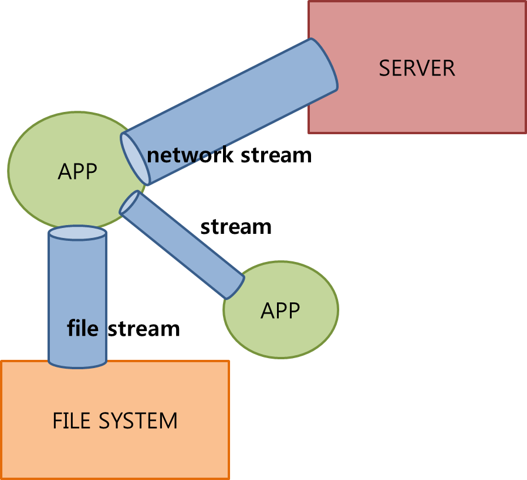

# 15 입출력 I/O

## 1. 자바에서의 입출력

### 1.2 스트림 stream

스트림이란 데이터를 운반하는데 사용되는 연결통로이다. 


### 1.3 바이트기반 스트림 - InputStream, OutputStream

stream : 1byte 단위로 읽고 쓴다.

스트림은 바이트단위로 데이터를 전송하며 입출력 대상에 따라 여러 입출력스트임이 있다.




### 1.4 보조 스트림

스트림의 기능을 보완하기 위한 보조스트림.

실제 데이터를 주고받는 스트림이 아니기 때문에 데이터를 입출력할 수 있는 기능은 없지만, 스트림의 기능을 향상시티거나 새로운 기능을 추가할 수 있다.

그래서 보조스트림만으로는 입출력을 처리할 수 없고, 스트림을 먼저 생성한 다음에 이를 이용해서 보조스트림을 생성해야한다.

```java
// 먼저 기반스트림을 생성한다.
FileInputStream fis = new FileInputStream("test.txt");

// 기반스트림을 이용해서 보조스트림을 생성한다.
BufferedInputStream bis = new BufferedInputStream(fis);

bis.read(); // 보조스트림으로부터 데이터를 읽는다.
```

### 1.5 문자기반 스트림 - Reader, Writer

바이트기반 스트림은 입출력의 반위가 1byte이다. 

java에서는 한 문자를 의미하는 char형이 1byte가 아니라 2byte이기 때문에 바이트기반의 스트림으로 2byte인 문자를 처리하는데는 어려움이 있다.

이 점을 보완하기 위해서 문자기반의 스트림을 사용한다.

InputStream → Reader

OutputStream → Writer


## 2. 스트림과 보조스트림

```java
package day03;

import java.io.FileInputStream;
import java.io.FileNotFoundException;
import java.io.IOException;

public class Fi1 {

	public static void main(String[] args) {
		FileInputStream fi = null;
		try {
			fi = new FileInputStream("test.txt");
			int data = 0;
			while((data=fi.read()) != -1) {
				char c = (char)data;
				System.out.print(c);
			} 
		} catch (FileNotFoundException e) {
			e.printStackTrace();
		} catch (IOException e) {
			e.printStackTrace();
		} finally {
			if(fi != null) {
				try {
					fi.close();
				} catch (IOException e) {
					try {
						Thread.sleep(2000);
					} catch (InterruptedException e1) {
						e1.printStackTrace();
					}
					try {
						fi.close();
					} catch (IOException e1) {
						e1.printStackTrace();
					}
				}
			}
		}
	}
}
-------------------------------------
abcd
¾?³???¼¼¿?
1234
```


- 한글깨지는 현상 해결 방법 : FileInputStream 대신 FileReader 사용

```java
FileReader fi = null;
		try {
			fi = new FileReader("test.txt");
-------------------------------------
abcd
안녕하세요
1234
```


- BufferedReader 사용

```java
FileReader fi = null;
		BufferedReader br = null;
		try {
			fi = new FileReader("test.txt");
			br = new BufferedReader(fi);
			String data = null;
			while((data=br.readLine()) != null) {
				System.out.println(data);
            }
--------------------------------
abcd
안녕하세요
1234

```


- 절대경로로 텍스트 파일 읽기

```java
package day03;

import java.io.FileInputStream;
import java.io.FileNotFoundException;

public class Fi2 {

	public static void main(String[] args) throws Exception {
		FileInputStream fis = new FileInputStream("C:\\network\\day03\\test.txt");
		System.out.println("available : "+fis.available());
		int data = 0;
		while((data=fis.read()) != -1) {
			char c = (char)data;
			System.out.print(c);
		}
		if(fis != null) {
			fis.close();
		}
	}
}
-----------------------------
available : 22
abcd
¾?³???¼¼¿?
1234
```


- FileOutputStream 으로 파일 쓰기

```java
package day03;

import java.io.BufferedInputStream;
import java.io.BufferedOutputStream;
import java.io.FileInputStream;
import java.io.FileOutputStream;

public class Fi2 {

	public static void main(String[] args) throws Exception {
		FileInputStream fis = new FileInputStream("C:\\network\\day03\\test.txt");
		BufferedInputStream bis = new BufferedInputStream(fis);

		FileOutputStream fos = new FileOutputStream("C:\\network\\day03\\test2.txt");
		BufferedOutputStream bos = new BufferedOutputStream(fos, 5); // 5byte 단위로 쓰기
		
		int data = 0;
		while ((data = bis.read()) != -1) {
			char c = (char) data;
			System.out.print(c);
			fos.write(c);
		}
		if (fis != null) {
			bis.close();
//			fis.close();
		}
		if (fos != null) {
			bos.flush();
			bos.close();
//			fos.close(); // 보조 stream만 close 하면 안에 있던 원래 stream도 close 된다.
		}
	}
}
```


C:\\network\\day03\\test2.txt 파일 생성됨.


- InputStream 대신 Reader, OutputStream 대신 Writer 사용하여 파일 읽고 쓰기 구현

```java
package day03;

import java.io.BufferedReader;
import java.io.BufferedWriter;
import java.io.FileNotFoundException;
import java.io.FileReader;
import java.io.FileWriter;

public class Fi3 {

	public static void main(String[] args) throws Exception {
		
		FileReader fis = new FileReader("C:\\network\\day03\\test.txt");
		BufferedReader bis = new BufferedReader(fis);
		
		FileWriter fos = new FileWriter("C:\\network\\day03\\test3.txt");
		BufferedWriter bos = new BufferedWriter(fos);
		
		String data = null;
		while((data=bis.readLine()) != null) {
			System.out.println(data);
			bos.write(data);
			bos.newLine();
		}
		if(bis != null) {
			bis.close();
		}
		if(bos != null) {
			bos.flush();
			bos.close();
		}
	}
}
```


## 6. 표준입출력과 File

### 6.1 표준입출력 - System.in, System.out, System.err


### 6.4 File

파일은 기본적이면서도 가장 많이 사용되는 입출력 대상.


## 7. 직렬화 Serialization

