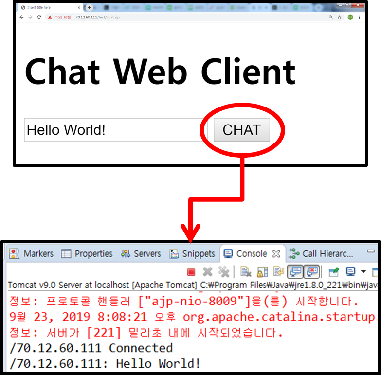

#### server와 client 양방향 통신(1대1 통신) 가능하게 하기

start 할때 보내는 thread와 받는 thread 필요

**Client.java**

```java
public class Client {

	Socket socket;
	InputStream in;
	DataInputStream din;
	OutputStream out;
	DataOutputStream dout;
	public Client() {}
	public Client(String ip, int port) {
		boolean flag = true;
		while(flag) {
			try {
				socket = new Socket(ip, port);
				if(socket != null && socket.isConnected()) {
					break;
				}
			} catch (Exception e) {
				System.out.println("Re-Try");
				try {
					Thread.sleep(3000);
				} catch (InterruptedException e1) {
					e1.printStackTrace();
				}
			}		
		}
	}
	public void start() throws Exception{
		try {
			out = socket.getOutputStream();
			dout = new DataOutputStream(out);
			dout.writeUTF("byebye");
			
			in = socket.getInputStream();
			din = new DataInputStream(in);
			String str = din.readUTF();
			System.out.println(str);
		}catch(Exception e){
			throw e;
		}finally{
			if(din != null) {
				din.close();
			}
			if(socket != null) {
				socket.close();
			}
		}
	}
	public static void main(String[] args) {
		Client client =  null;
		client = new Client("70.12.60.111", 88);
		try {
			client.start();
		} catch (Exception e) {
			e.printStackTrace();
		}
	}
}
```

**Server.java**

```java
class ServerThread extends Thread{
	Socket socket;
	OutputStream out;
	DataOutputStream dout;
	InputStream in;
	DataInputStream din;
	public ServerThread(Socket socket) throws IOException {
		this.socket = socket;
		out = socket.getOutputStream();
		dout = new DataOutputStream(out);
		in = socket.getInputStream();
		din = new DataInputStream(in);
	}
	public void run() {
		try {
			String str = null;
			str = din.readUTF();
			System.out.println(socket.getInetAddress()+" : "+str);
			dout.writeUTF("안녕");
		} catch (IOException e) {
			e.printStackTrace();
		} finally {
			if(dout != null) {
				try {
					dout.close();
				} catch (IOException e) {
					e.printStackTrace();
				}
			}
			if(din != null) {
				try {
					din.close();
				} catch (IOException e) {
					e.printStackTrace();
				}
			}
		}
	}
}
public class Server {
	boolean flag = true;
	Socket socket;
	ServerSocket serverSocket;
	OutputStream out;
	DataOutputStream dout;	
	public Server() {}	
	public Server(int port) throws IOException{
		serverSocket = new ServerSocket(port);
		System.out.println("Server Start");
	}	
	public void start() throws Exception{
		while(flag) {
			System.out.println("ServerReady");
			socket = serverSocket.accept();	
			System.out.println(socket.getInetAddress());
			new ServerThread(socket).start();
		}
		System.out.println("Server End");
	}	
	public static void main(String[] args) {
		Server server = null;
		try {
			server = new Server(88);
			server.start();
		} catch (Exception e) {
			e.printStackTrace();
		}	
	}
}
```


#### Multy - Chatting

#### 웹을 활용한 채팅



**Client.java**

**chat.jsp**

```jsp
<%@ page language="java" contentType="text/html; charset=EUC-KR"
    pageEncoding="EUC-KR"%>
<!DOCTYPE html>
<html>
<head>
<script src="https://ajax.googleapis.com/ajax/libs/jquery/3.4.1/jquery.min.js"></script>
<meta charset="EUC-KR">
<title>Insert title here</title>
<script>
function sendMsg(msg){
	$.ajax({
		url:'chat',
		data:{"msg":msg},
		success:function(data){
			$('#msg').val('');
		}
	});
}
function bt(){
	var msg = $('#msg').val();
	alert(msg);
	sendMsg(msg);
};
</script>
</head>
<body>
<h1>Chat Web Client</h1>
<input id="msg" type="text" name="msg">
<button onclick="bt();">CHAT</button>
</body>
</html>
```


**ChatServelet.java**

```java
package chat;

import java.io.IOException;
import javax.servlet.ServletException;
import javax.servlet.annotation.WebServlet;
import javax.servlet.http.HttpServlet;
import javax.servlet.http.HttpServletRequest;
import javax.servlet.http.HttpServletResponse;

@WebServlet({ "/ChatServlet", "/chat" })
public class ChatServlet extends HttpServlet {
	private static final long serialVersionUID = 1L;
	Client client;
	public ChatServlet() {
		try {
			client = new Client("70.12.60.110", 1234);
		} catch (IOException e) {
			e.printStackTrace();
		}
	}
	protected void service(HttpServletRequest request, HttpServletResponse response) throws ServletException, IOException {
		String msg = request.getParameter("msg");
		client.sendMsg(msg);	
	}
}
```


