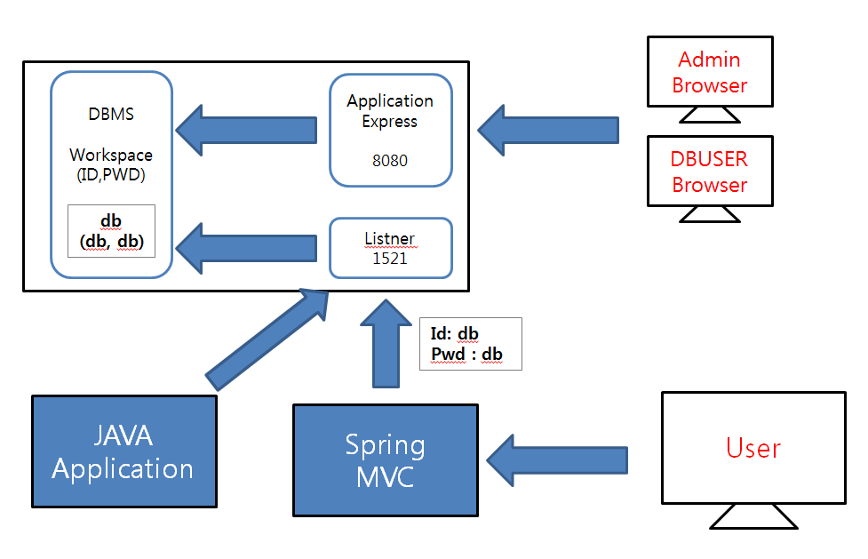

- HW 기반으로 만든 MAC OS(리눅스)
- 가상머신에 컴퓨터가 들어가있는 모양
- 가상머신 다운받아서 가상환경 만들기
- 가상HW 만들기 centOS-64
- 빅데이터 환경을 구성하기 위해 리눅스 사용


## CentOS

### I. Client 설치 - 서버 2개 만들기


### II. IP 할당

DHCP(Dynamic Host Configuration Protocol) : 자동으로 IP 할당받음

p. 68, 게시판 VMware IP Setting

- 


### III. 서버 보안 및 네트워크 설정 변경

#### step1~3

- 1406 시점의 OS에 맞는 sw 설치하기 위한 작업

- 업데이트 하지 않기 위한 작업

#### step4

server 변경

```
>hostnamectl set-hostname server1
>gedit /etc/hosts
// 추가 할 내용
192.168.111.100		server1
//ping 찍어서 확인해보기
>ping server1

```

#### step5~6

- 보안 설정 해제 작업
- 화면 보호기 해제


#### 디렉토리 만들기 mkdir

```
mkdir vitest
cd vitest
```

#### 파일 생성 touch

```
touch t2.txt
vi t2.txt
```

#### 명령모드에서 상하좌우

h 좌 j 하 k 상 l 우

a : 오른쪽에 insert

i : 왼쪽에 insert

A : 문장 맨 끝에 오른쪽 insert 

I : 문장 맨 앞에 왼쪽 insert

#### 원복 vim -r

```
vim -r t2.txt
rm .t2.txt.swp
```

#### mount 되어 있는 CD를 분리시키기

```
umount /dev/cdrom
```

/run/media/root 에 존재했던 CentOS 7 x86_64 사라진것 확인

#### 특정 dir에 cdrom mount

```bash
mkdir mycdrom
mount /dev/cdrom /mycdrom
cd /mycdrom
ls 
mount
umount /mycdrom
```

폴더 생성한 후 그 폴더에 마운트해야함

셸 : 리눅스 사용자들 마다의 테마를 부여할 수 있음

```bash
useradd user1
passwd user1
암호 입력 : 111111
tail passwd로 확인
```


```
alias rm ='rm -i'
alias ls ='ls -l'
alias ll ='clear'
```


home dir에는 사용자 정보가 들어있어서 백업할때 home을 통째로 백업함.

```
chmod 666 cc.txt

```

x 권한 : 실행 권한 (폴더 접근)

./runls.sh : 현재 디렉토리 아래에 있는 sh파일 실행하겠다

PATH=.:$PATH  :  현재 디렉토리를 path로 지정해줌.


##### 바이러스가 없는 리눅스?


#### 파일의 소유권

- dir의 그룹 소유권 변경 : mudir을 multi 그룹의 소유로 바꿔줌.

  ```
  chgrp multi mudir
  ```

#### 링크

- 윈도우에서는 인터넷익스플로러 바로가기를 바탕화면에 만드는것과 같음

- 심볼릭 링크

  - 원본파일과 연결되는 링크파일

  - 원본파일의 포인터를 가리킴

    ```
    ln -s linktest/ltest slink
    ```

    

- 하드링크

  - 파일사이즈가 동일하면서 링크 걸림. 또다른 공간에 동일한 파일을 생성하여 연결하여 사용

  - 원본파일과 동일한 위치 지칭

  - 하드링크 삭제해도 원본파일 존재해서 괜찮음

    ```
     ln linktest/ltest hlink
    ```

```
[root@server1 ~]# ls -il
 37327614 -rw-------  2 root root 1525  7월 23 10:10 hlink
 37341079 lrwxrwxrwx  1 root root   14  7월 23 10:12 slink ->
 linktest/ltes
```

 which java : 자바 위치 알려주는 명령어

### 리눅스 관리자를 위한 명령어

#### 1. 프로그램 설치를 위한 RPM

#### RPM

- 프로그램을 설치한 후에 바로 실행할 수 있는 설치 파일.
- 설치 파일의 확장명 .rpm (패키지)
- 설치 : rpm -Uvh 패키지파일이름.rpm
- 삭제 : rpm -e 패키지이름
- 단점 
  - '의존성' 문제 : 한 패키지가 설치되기 위해선 관련있는 다른 패키지가 먼저 설치되어야한다.

#### 2. 편리하게 패키지를 설치하는 YUM

#### YUM


#### oracle 특징

- 데이터저장소
- listener
- 관리


#### 파일 압축과 묶기

압축은 디렉토리에 못하고 하나의 파일에다가 초면ㅇㅊㅇ


#### 파일 위치 검색

- find + 경로 + 옵션 + 조건

```
find /etc -name *.conf
find /home -user user1
find /usr/bin -perm 644
find /usr/bin -size +10k -size +100k
find ~ -size 0k -exec cp {} temp \;
```

- which + 실행파일이름 : PATH 에 설정된 dir만 검색 
- whereis + 실행파일이름 : 실행 파일, 소스, man 페이지 파일까지 검색
- locate + 파일이름 : 명령어 실행이후에 찾을 수 있음

```
[root@server1 temp]# whereis java
java: /usr/bin/java /usr/lib/java /etc/java /usr/share/java /usr/share/man/man1/java.1.gz
[root@server1 temp]# which java
/usr/bin/java
```


#### 시스템 설정

- 방화벽 설정
  - firewall-config


### TOMCAT 연동

#### 환경설정

- etc/profile

```
JAVA_HOME=/etc/jdk1.8
export JAVA_HOME
CLASSPATH=$JAVA_HOME/lib
export CLASSPATH
PATH=.:$JAVA_HOME/bin:$PATH
```
- reboot

- firewall-config

  - 런타임, 영구적 - 서비스 - :ballot_box_with_check: http

#### tomcat 다운로드

- conf/server.xml
  - line 69 : port 80으로 변경

>  /root/file/apache-tomcat-9.0.22/bin


- shutdown.sh : 톰캣 종료

- startup.sh : 톰캣 시작

  ```
  [root@server1 bin]# startup.sh 
  Using CATALINA_BASE:   /root/file/apache-tomcat-9.0.22
  Using CATALINA_HOME:   /root/file/apache-tomcat-9.0.22
  Using CATALINA_TMPDIR: /root/file/apache-tomcat-9.0.22/temp
  Using JRE_HOME:        /etc/jdk1.8
  Using CLASSPATH:       /root/file/apache-tomcat-9.0.22/bin/bootstrap.jar:/root/file/apache-tomcat-9.0.22/bin/tomcat-juli.jar
  Tomcat started.
  ```
  


### ECLIPSE 설치

#### eclipse 다운로드

- file 폴더에 eclipse 파일 복붙

- 압축파일 풀기

  ```
  tar xvf eclipse~
  ```

- /etc에 eclipse copy

  ```
  cp -r eclipse /etc
  ```

- /usr/bin 에서 'eclipse' 심볼릭링크 생성

  ```
  ln -s /etc/eclipse/eclipse eclipse
  ```

- eclipse 명령어 입력으로 eclipse 열기


1. network 설정

   /etc/sysconfig/network-scripts/ifcfg-ens33

   systemctl restart network

2. user 설정

   useradd

   permission

   chmod, chown, chgrp

3. tar, zip(unzip)

4. rpm, yum(localinstall, install)

5. Program setting

   JDK, Eclipse, Tomcat

   etc/profile 에서 환경설정

   /usr/bin(PATH에 잡혀있음) 에 링크 생성 ln -s

   firewall-config : 포트 열기(1521 listner, 80 관리자)


### cron

p.233

- 주기적으로 반복되는 일을 자동으로 실행 할 수 있도록 시스템 작업을 예약해 놓는 것

```
00 05 1 * * root cp -r /home /backup
```

매월 1일 5시 0분에 실행한다. /home dir을 /backup dir에 복사

- crontab에 설정 추가

  - 매월 24일 11시 10분에 /home을 /backup dir에 복사

  ```
  10 11 24 * * root cp -r /home /backup
  ```

- crond 확인

  ```
[root@server1 ~]# systemctl status crond
crond.service - Command Scheduler
   Loaded: loaded (/usr/lib/systemd/system/crond.service; enabled)
   Active: active (running) since 수 2019-07-24 18:11:45 KST; 7h left
 Main PID: 670 (crond)
   CGroup: /system.slice/crond.service
           └─670 /usr/sbin/crond -n
   7월 24 18:11:45 server1 systemd[1]: Started Command Scheduler.
   7월 24 18:11:45 server1 crond[670]: (CRON) INFO (RANDOM_DELAY will be scaled with factor 20% if used.)
   7월 24 18:11:45 server1 crond[670]: (CRON) INFO (running with inotify support)
  ```

- /backup dir 가서 확인


### at

p.234

- 일회성 작업을 예약하는것

- 예약해 놓으면 한 번만 실행되고 소멸된다.

  - 오늘 11:25에 /home 을 /backup 에 copy하고 reboot 해라

  ```
[root@server1 ~]# at 11:25 am today
at> cp -r /home /backup
at> reboot // ctrl + d
job 1 at Wed Jul 24 11:25:00 2019
[root@server1 ~]# at -l // 확인
	1	Wed Jul 24 11:25:00 2019 a root
	```

### 네트워크

- TCP/TP

  - 프로토콜 : 컴퓨터끼리 네트워크상으로 의사소통하는 약속 
  - TCP : 통신의 전송/수신
  - IP : 데이터 통신

- 호스트 이름과 도메인 이름

  - 호스트 이름 : 각각의 컴퓨터에 지정된 이름

  ```
  hostname
  hostnamectl set-hostname server1
  /etc/hosts
  192.168.111.111 	server1
  ```

  - 도메인 이름 : naver.com(IP 주소가 존재함)

- IP 주소

  - 원하는 도메인 IP 주소 확인하기

  ```
  [root@server1 ~]# nslookup
  > www.naver.com
  Server:		192.168.111.2
  Address:	192.168.111.2#53
  
  Non-authoritative answer:
  www.naver.com	canonical name = www.naver.com.nheos.com.
  Name:	www.naver.com.nheos.com
  Address: 210.89.164.90
  Name:	www.naver.com.nheos.com
  Address: 125.209.222.141
  ```

## Oracle DB 설치

p.571

> https://www.oracle.com/technetwork/database/database-technologies/express-edition/downloads/xe-prior-releases-5172097.html
>
> Oracle Database Express Edition (XE) Release 11.2.0.2.0 (11gR2)
>
> Linux x64

### server에 리눅스용 Oracle DB 설치

- ***step1*** /file 에 압축파일 복붙

  ```
  unzip oracle
  -> Disk1 생김
  ```

- ***step2*** swap 늘려주기 4G 추가

- ***step3*** oracle을 사용할 수 있는 포트 열기

- ***step4*** 웹에서 oracle에 접속해보기


부팅usb에 리눅스 io파일 넣고..!


war : web application archive

- web app의 묶음


##### 7/25



## eclipse와 oracleDB 연동

eclipse의 'oracledb'프로젝트 buildpath에  oracledb library 추가

`Test.java 파일`

```java
package oracledb;

import java.sql.Connection;
import java.sql.DriverManager;
import java.sql.PreparedStatement;
import java.sql.ResultSet;

public class Test {

	public static void main(String[] args) throws Exception{
		
		String id="db";
		String pwd="db";
		String url="jdbc:oracle:thin:@192.168.111.111:1521:XE";
		
		Class.forName("oracle.jdbc.OracleDriver");
		
		Connection con = DriverManager.getConnection(url, id, pwd);
		
		String sql ="SELECT * FROM DEPT";
		
		PreparedStatement pstmt = con.prepareStatement(sql);
		
		ResultSet rset = pstmt.executeQuery();
		
		while(rset.next()) {
			int deptno = rset.getInt("DEPTNO");
			String dname = rset.getString("DNAME");
			String loc = rset.getString("LOC");
			System.out.println(deptno+" "+dname+" "+loc);
		}
	}

}
```


## eclipse 프로젝트를 war파일로 export하여 TOMCAT에 배포

#### CASE 1

***step1*** eclipse에서 'test' dynamic web project 생성

- 'web' 에 index.jsp 생성
- http://70.12.114.62/test/ 에서 동작 확인

***step2*** 'test' (우클) - Export - WAR file => test.war 생성

- 'server1'의 /file에 'test.war' 복사 붙여넣기

- tomcat 동작 확인 => 동작 X

  ```
  [root@server1 file]# ps -ef | grep tomcat
  root      7834  3897  0 11:07 pts/0    00:00:00 grep --color=auto tomcat
  
  ```

- /root/file/apache-tomcat-9.0.22/webapps 에 war 파일 복사붙여넣기

  ```
  cp ~/file/*.war .
  ```

- /root/file/apache-tomcat-9.0.22/bin 에서 tomcat 실행

  ```
  startup.sh
  ```

- /root/file/apache-tomcat-9.0.22/webapps 에 'test' dir 생김

  : 서버가 돌아가면서 자동으로 생성됨

- http://192.168.111.111/test/ 에서 동작 확인


#### CASE 2

***step1*** eclipse에서 'test2' dynamic web project 생성

- "context root : / " 로설정 변경
- 'web' 에 index.jsp 생성
- http://70.12.114.62/ 에서 동작 확인

***step2*** 'test2' (우클) - Export - WAR file => test2.war 생성

- 'server1'의 /file에 'test2.war' 복사 붙여넣기

- /root/file/apache-tomcat-9.0.22/webapps 에 war 파일 복사붙여넣기

  ```
  cp ~/file/*.war .
  ```

- /webapps 에서 ROOT dir 이름 변경

  ```
  mv ROOT ROOT_BACK
  mv test2 ROOT
  ```

- 서버 종료 후 재시작

  ```
  ./shutdown.sh
  startup.sh
  ```

- http://192.168.111.111/ 에서 동작 확인


#### 파이프, 필터, 리다이렉션

**파이프** : 2개의 프로그램

```
ls -l /etc | more
```

**필터** : 필요한 것만 걸러주는 명령어

```
ps -ef | grep oracle
```

**리다이렉션** : 표준 입출력의 방향을 바꾼다


## MariaDB 설치 p.554

centOS + MariaDB + Web Server

> https://downloads.mariadb.org/mariadb/10.0.15/ 
>
> -> [centos7-amd64](http://ftp.hosteurope.de/mirror/archive.mariadb.org/mariadb-10.0.15/yum/centos7-amd64/)/ -> [rpms](http://ftp.hosteurope.de/mirror/archive.mariadb.org/mariadb-10.0.15/yum/centos7-amd64/rpms/)/
>
> [MariaDB-10.0.15-centos7_0-x86_64-common.rpm](http://ftp.hosteurope.de/mirror/archive.mariadb.org/mariadb-10.0.15/yum/centos7-amd64/rpms/MariaDB-10.0.15-centos7_0-x86_64-common.rpm)
>
> [MariaDB-10.0.15-centos7_0-x86_64-client.rpm](http://ftp.hosteurope.de/mirror/archive.mariadb.org/mariadb-10.0.15/yum/centos7-amd64/rpms/MariaDB-10.0.15-centos7_0-x86_64-client.rpm)
>
> [MariaDB-10.0.15-centos7_0-x86_64-server.rpm](http://ftp.hosteurope.de/mirror/archive.mariadb.org/mariadb-10.0.15/yum/centos7-amd64/rpms/MariaDB-10.0.15-centos7_0-x86_64-server.rpm)


### 실습1 p.554

`server를 DBMS 전용 서버로 운영`

1. /root/file/maria 에 3개 파일 복사 붙여넣기

2. step2 진행

### 실습2 p.560

`MariaDB의 기본적인 보안환경 설정`

1. step1 진행

   ```
   mysqladmin -u root password '111111'
   mysql => 접속 불가
   mysql -u root -p => 비밀번호 111111 입력 후 접속
   ```

2. step4 진행

   `'mysql' 데이터베이스에 있는 'user' 테이블 조회`

   ```
   MariaDB [(none)]> USE mysql;
   
   MariaDB [mysql]> SELECT user, host FROM user;
   +------+-----------+
   | user | host      |
   +------+-----------+
   | root | 127.0.0.1 |
   | root | ::1       |
   |      | localhost |
   | root | localhost |
   |      | server2   |
   | root | server2   |
   +------+-----------+
   ```

   `IP 주소를 사용하여 접속할 수 있도록 사용자 생성`

   ```
   MariaDB [mysql]> GRANT ALL PRIVILEGES ON *.* TO user1@'192.168.111.%' IDENTIFIED BY '111111';
   
   MariaDB [mysql]> GRANT ALL PRIVILEGES ON *.* TO user1@'70.12.114.%' IDENTIFIED BY '111111';
   
   MariaDB [mysql]> GRANT ALL PRIVILEGES ON *.* TO user1@'localhost' IDENTIFIED BY '111111';
   ```

   `'user' 테이블 다시 조회하여 사용자 생성 확인`

   ```
   MariaDB [mysql]> SELECT user, host FROM user;
   +-------+---------------+
   | user  | host          |
   +-------+---------------+
   | root  | 127.0.0.1     |
   | user1 | 192.168.111.% |
   | user1 | 70.12.114.%   |
   | root  | ::1           |
   |       | localhost     |
   | root  | localhost     |
   | user1 | localhost     |
   |       | server2       |
   | root  | server2       |
   +-------+---------------+
   ```

   `user1 으로 접속`

   ```
   mysql -u user1 -p => 비밀번호 111111 입력 후 접속
   ```

### 실습3 p.567

`쇼핑몰 데이터베이스 MariaDB 서버에 구축`

1. step0 진행

   ```
   mysql -u user1 -p 
   ```

2. step1진행

   `'shop' 데이터베이스 생성하고 확인 `

   ```
   MariaDB [(none)]> create database shop;
   
   MariaDB [(none)]> use shop;
   
   MariaDB [shop]> show databases;
   +--------------------+
   | Database           |
   +--------------------+
   | information_schema |
   | mysql              |
   | performance_schema |
   | shop               |
   | test               |
   +--------------------+
   ```

   `'shop'에 PRODUCT 테이블 생성`

   ```sql
   CREATE TABLE PRODUCT(
   	ID INT PRIMARY KEY,
   	NAME NVARCHAR(20) NOT NULL,
   	PRICE INT NOT NULL,
   	REGDATE DATE
   );
   ```

   `data INSERT`

   ```sql
   INSERT INTO PRODUCT VALUES (100,'pants1', 10000, SYSDATE());
   INSERT INTO PRODUCT VALUES (101,'pants2', 20000, SYSDATE());
   INSERT INTO PRODUCT VALUES (102,'pants3', 30000, SYSDATE());
   INSERT INTO PRODUCT VALUES (103,'pants4', 40000, SYSDATE());
   INSERT INTO PRODUCT VALUES (104,'pants5', 50000, SYSDATE());
   ```

   `data 확인`

   ```
   MariaDB [shop]> select * from PRODUCT;
   +-----+--------+-------+------------+
   | ID  | NAME   | PRICE | REGDATE    |
   +-----+--------+-------+------------+
   | 100 | pants1 | 10000 | 2019-07-25 |
   | 101 | pants2 | 20000 | 2019-07-25 |
   | 102 | pants3 | 30000 | 2019-07-25 |
   | 103 | pants4 | 40000 | 2019-07-25 |
   | 104 | pants5 | 50000 | 2019-07-25 |
   +-----+--------+-------+------------+
   ```


## eclipse와 MariaDB 연동

> https://downloads.mariadb.org/connector-java/2.4.2/
>
> -> [MariaDB Connector/J .jar files](https://downloads.mariadb.com/Connectors/java/connector-java-2.4.2)
>
> -> [mariadb-java-client-2.4.2.jar](https://downloads.mariadb.com/Connectors/java/connector-java-2.4.2/mariadb-java-client-2.4.2.jar)

eclipse의 'oracledb'프로젝트 buildpath에  library 추가

`Test2.java`

```java
package oracledb;

import java.sql.Connection;
import java.sql.DriverManager;
import java.sql.PreparedStatement;
import java.sql.ResultSet;

public class Test2 {

	public static void main(String[] args) throws Exception{
		
		String id="user1";
		String pwd="111111";
		String url="jdbc:mariadb://192.168.111.111:3306/shop";
		
		Class.forName("org.mariadb.jdbc.Driver");
		
		Connection con = DriverManager.getConnection(url, id, pwd);
		
		String sql ="SELECT * FROM PRODUCT";
		
		PreparedStatement pstmt = con.prepareStatement(sql);
		
		ResultSet rset = pstmt.executeQuery();
		
		while(rset.next()) {
			int iid = rset.getInt("ID");
			String name = rset.getString("NAME");
			int price = rset.getInt("PRICE");
			String date= rset.getString("REGDATE");
			System.out.println(iid+" "+name+" "+price+" "+date);
		}
	}

}
```


workshop

1. 서버2에 오라클과 마리아디비 설치
2. 서버1의 마리아디비에서 프로덕트 데이터를 조회하여 조회한 데이터를 서버2의 오라클과 마리아디비에 insert하시오


##### 7/26


##### 7/29

fdisk : 파티션 나누기

## 6.2 여러 개의 하드디스크를 하나처럼 사용하기

hdd 삭제

- fdisk에서 mount 취소하고 삭제해야함

  ```
  vi /etc/fstab
  // 맨 아래에 추가해 놓은 문장 주석처리 
  ```


#### RAID

- 여러개의 하드디스크를 하나의 하드디스크처럼 사용하는 방식
- 비용 절감, 신뢰성 증가, 성능 향상
- HW RAID는 SW RAID보다 좀 안정적이지만 매우 비싸다.

Linear RAID : 앞 하드디스크에 데이터가 완전히 저장된 후, 순차적으로 다음 하드데스크에 다음 데이터를 저장

RAID0 : 속도 아주 빠름

RAID1 :  하드디스크 한장 날라가도 한장 남아 있음.

RAID5 : 속도 빠르고 데이터 보장.

RAID6 : 

1. 각각의 Disk를 fdisk - fd(파일형식 Linux raid로 변경)

   ```
   fdisk /dev/sdb
   ```

2. mdadm로 포멧 후 disk 묶기

   ```
   mdadm --create /dev/md9 --level=linear --raid-devices=2 /dev/sdb1 /dev/sdc1  // => RAID 생성
   mdam --detail --scan  // => RAID 확인
   ```

3. mkfs.ext4

   ```
   mkfs.ext4 /dev/md9
   ```

4. linear 폴더 생성

   ```
   mkdir /linear
   ```

5. mount

   ```
   mount /dev/md9 /linear
   ```

6. /etc/fstab에 등록

   ```
   vi /etc/fstab
   // 마지막줄에 추가
   /dev/sdb1		/linear		ext4	defaults	1 2
   ```


raid1linear

- 1+2=3G
- 

raid0 : 

- 1+1=2
- 동시에 공간확보 (복제)

 raid1

- 1g

raid5

- 1+1+1=2
- 디스크 3장이지만 쓸수 있는 공간은 2G


#### RAID 문제 발생과 조치 방법 p.361

1. Hard Dist 3,5,7,9 remove
2. /etc/fstab 디스크 속성 정의해주는 문장 삭제 후 reboot
3. linear, raid0 복구 안됨. 다시 만들어야함
   - linear : 두개 쌍으로 움직일때 복구 x
   - raid0 : 복구 불능
4. raid1, raid5는 정상이므로 하드디스크 증설.


##### 7/30


## 6.3 LVM p.386

### LVM 개념 이해

- Logical Volume Manager
- 여러개의 디스크를 한개의 파티션으로 합친 후, 다시 필요에 따라 쪼개서 사용
- 사용자들에게 할당되는 디스크
- 볼륨
  - 물리 볼륨(Physical Volume) : /dev/sda1, /dev/sdb1 등의 파티션
  - 볼륨 그룹(Volume Group) : 물리 볼륨을 합쳐서 1개의 물리 그룹으로 만든것
  - 논리 볼륨(Logical Volume) : 볼륨 그룹을 1개 이상으로 나눈 것(=논리적 그룹)

### LVM 구현

1. 서버에 2GB, 3GB 용량의 하드디스크 추가

2. 선처리 작업

   - 하드디스크에 파티션 할당

   ```
   fdisk /dev/sdb
   // 파일시스템 유형 : 8e
   ```

   - 물리적 볼륨 생성

   ```
   pvcreate /dev/sdb1
   pvcreate /dev/sdc1
   ```

   - 볼륨 그룹 생성 : 두개의 물리적 볼륨 하나로 묶기

   ```
   vgcreate myVG /dev/sdb1 /dev/sdc1
   vgdisplay // 볼륨 그룹 생성 확인
   ```

3. 볼륨 그룹 파티션 생성

   ```
   lvcreate --size 1G --name myLG1 myVG
   lvcreate --size 3G --name myLG2 myVG
   lvcreate --extents 100%FREE --name myLG3 myVG // 나머지 용량 모두 할당
   ls -l /dev/myVG // 디렉토리 확인
   ```

4. 파일시스템 생성

   ```
   mkfs.ext4 /dev/myVG/myLG1
   mkfs.ext4 /dev/myVG/myLG2
   mkfs.ext4 /dev/myVG/myLG3
   ```

5. 디렉토리 생성 후 마운트

	```
	mkdir /lvm1 /lvm2 /lvm3  // 디렉토리 생성
	mount /dev/myVG/myLG1 /lvm1  // mount
	mount /dev/myVG/myLG2 /lvm2
	mount /dev/myVG/myLG3 /lvm3
	df  // 확인
	```

6. 컴퓨터 결때마다 마운트되도록 설정

   - vi로 /etc/fstab 열어서 맨 아래에 추가

   ```
   /dev/myVG/myLG1  /lvm1  ext4  defaults  1 2
   /dev/myVG/myLG2  /lvm2  ext4  defaults  1 2
   /dev/myVG/myLG3  /lvm3  ext4  defaults  1 2
   ```


## 6.4 RAID 에 CentOS 설치하기 p.392

### 실습 12

2개의 30GB 하드디스크에서 RAID1으로 안전하게 작동되는 CentOS를 새로 설치하자

### *step0*

가상머신 생성

### *step1*


### *step2*


### *step3*


### *step4*


fdisk -l /dev/sda 로 확인

fdisk /dev/sdb 파티션 1,2로 나누기

fdisk로 파티션1,2 할당


gnome없이 jdk, tomcat 설치해야함

https://download.oracle.com/otn/java/jdk/8u221-b11/230deb18db3e4014bb8e3e8324f81b43/jdk-8u221-linux-x64.rpm


##### 7/31

# 07. 셸 스크립트 프로그래밍

## 7.1 셸의 기본

윈도우의 DOC와 같음

chmod 744 *

name.sh


para2.sh /home /mybackup

echo "start,,,"
tar cvfJ $1.tar.xz $1
mv $1.tar.xz $2
echo "end..."


 para3.sh /home sh /shfile


##### 8/1

## shell script code


 wget http://70.12.114.62/test/jdk1.8.tar.gz


envset.sh 실행시키면 jdk,톰캣,이클립스를 서버에 설치

메뉴를 구성 하여 설치를 진행 한다.

단 설치가 되어 있을 경우 삭제 후 설치를 진행 한다.

중간에 사용자에게 물어 보면서 진행(삭제하시겠습니까? 설치하시겠습니까?)

1. jdk 설치

   /etc/jdk1.8

   /usr/bin/java	softlink

   ```
   tar xvzf jdk1.8.tar.gz -C /root/filetemp/temp
   ```

   

2. tomcat 설치

   /etc/tomcat

   /usr/bin/startcat	softlink

   /usr/bin/stopcat	softlink

   

3. eclipse 설치

   /etc/eclipse

   /usr/bin/eclipse	softlink

   

4. 

server에 이클립스, 톰캣, jdk 복사

server 실행

