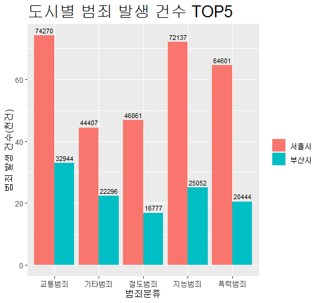

**R**

**변수**

1. scalar
2. matrix
3. factor
4. vector
5. dataframe


### ggplot2 패키지 활용  p.70

**step00 패키지 설치**

```R
install.packages("ggplot2")
```

**step01**

```R
# ggplot2 패키지 로드
library(ggplot2)
```

**step02 함수 사용하기**

```R
# 여러문자로 구성된 변수 생성
x <- c("a","a","b","c","e")
# 빈도 막대 그래프 출력
qplot(x)
```

**code**

```R
g1 <- function(){
  library(ggplot2)
  x <- c("a","a","b","c","e")
  qplot(x)
}
```


### 함수로 데이터 추출 p.318

- 조건을 충족하는 행 추출하기

```R
stu[stu$KO >= 95,]
stu[stu$KO >= 95 & stu$SI > 66,]
stu[stu$KO >= 95 & stu$SI > 66,c("KO", "SI")]
```

- 내장함수 aggregate 활용

```R
# 평균 만들어주기
stu$AVG <- rowMeans(stu[,c(3:6)])
# class 만들기
stu$CLASS <- c(1,1,1,2,2,2,3,3)
# aggregate 활용 group by 함수처럼 쓰임.
# A~B,C A:함수 사용 대상 B:묶음 C:함수
aggregate(data=stu,AVG~CLASS,mean)
aggregate(data=stu[stu$KO>=92,],AVG~CLASS,mean)
```


#### 변환 함수 p.330

| 함수            | 기능                |
| --------------- | ------------------- |
| as.numeric()    | numeric으로 변환    |
| as.factor()     | factor으로 변환     |
| ac.character()  | character으로 변환  |
| as.Date()       | Date으로 변환       |
| as.data.frame() | Data Frame으로 변환 |


### 외부 데이터 이용하기

#### excel 파일

- 설치

```
install.packages("readxl")
```

- excel 파일 생성
- 파일 로드 & 읽기

```R
library(readxl)
st <- read_excel("st.xlsx")
```


####  변수명 바꾸기

- 패키지 설치 & 로드

```
install.packages("dplyr")
library(dplyr)
```

- 변수명 바꾸기

```R
library(readxl)
library(dplyr)
st <- read_excel("st.xlsx")
# MATH 열의 이름을 MA로 변경
st <- rename(st,MA=MATH) 
```

#### 조건문 활용하여 파생변수 만들기 p.117

- 평균 구하기

```R
st$AVG <- rowMeans(st[,c(3:5)])
```

- 합격 판정 변수 만들기

```R
st$LEVEL <- ifelse(st$AVG >=90, "PASS", "FAIL")
```

```
     ID CLASS    MA   ENG   SCI   AVG LEVEL
  <dbl> <dbl> <dbl> <dbl> <dbl> <dbl> <chr>
1     1     1    90    90    91  90.3 PASS 
2     2     1    80    80    81  80.3 FAIL 
3     3     2    70    70    71  70.3 FAIL 
4     4     2   100   100    99  99.7 PASS 
5     5     3    90    90    88  89.3 FAIL
```

- level에 따른 평균 구하기

```R
aggregate(data=st, AVG~LEVEL,mean)
```

```
  LEVEL AVG
1  FAIL  80
2  PASS  95
```

- GRADE 생성

```R
# 90이상 A, 80이상 B, 70이상 C인 GRADE 생성
st$GRADE <- ifelse(st$AVG >= 90, "A",
                   ifelse(st$AVG >=80, "B",
                          ifelse(st$AVG >=70, "C", "F")))
```

```
     ID CLASS    MA   ENG   SCI   AVG GRADE
  <dbl> <dbl> <dbl> <dbl> <dbl> <dbl> <chr>
1     1     1    90    90    91  90.3 A    
2     2     1    80    80    81  80.3 B    
3     3     2    70    70    71  70.3 C    
4     4     2   100   100    99  99.7 A    
5     5     3    90    90    88  89.3 B  
```

- table로 나타내기

```
ta <- table(st$GRADE)
--------------------
A B C 
2 2 1
# datafram으로 변환
as.data.frame(ta)
--------------------
  Var1 Freq
1    A    2
2    B    2
3    C    1
```


## 06 자유자재로 데이터 가공하기

#### 조건에 맞는 데이터만 추출하기

- filter() 활용하기

```R
st %>% filter(CLASS==1)
st[st$CLASS==1,]
```

- %in% 활용하기

```
st[st$CLASS!=1 & st$MATH >= 90,]
st[st$CLASS %in% c(2:3) & st$MATH >= 90,]
```


### ws01 p.123

```R
library(ggplot2)
# p.123
# 문제1
data <- as.data.frame(midwest)
# 문제2
data <- rename(data,total=poptotal)
data <- rename(data,asian=popasian)
# 문제3
data$PERCENT <- data$asian/data$total*100
qplot(data$PERCENT)
# 문제4
avg <- mean(data$PERCENT)
data$AVG <- ifelse(data$PERCENT > avg, "large", "small")
# 문제5
data_table <- table(data$AVG)
as.data.frame(data_table)
qplot(data$AVG)
```

### ws02 p.150

```R
# p.150
# q1
cla <- aggregate(data=mpg, cty~class,mean)
# q2
cla2 <- cla[order(cla$cty, decreasing = T),]
# q3
hwy_com <- aggregate(data=mpg, hwy~manufacturer,mean)
hwy_com <- hwy_com[order(hwy_com$hwy,decreasing=T),]
head(hwy_com,3)
# q4
aa <- mpg[mpg$class=="compact",]
com_max <- aggregate(data=aa, class~manufacturer, length)
com_max <- com_max[order(com_max$class,decreasing=T),]
```


### ws03

> 1. data file 취합
> 2. what
> 3. graph

1. data file 취합
   - 범죄 data 활용
   - r3/bum.csv
2. what
   - 도시 별 범죄 건수 top5 그래표로 나타내기
3. graph



> https://m.blog.naver.com/liberty264/221012414656 참고해서 그래프 그림

**r3/r10_ws**

```R
library(sqldf)
library(ggplot2)
library(dplyr)
library(reshape2)
bum <- read.csv("bum.csv",
                header=TRUE,
                stringsAsFactors = FALSE,
                na.strings = "NA"
)

bum_data <- sqldf('select 범죄대분류, sum(서울) as 서울시, 
            sum(부산) as 부산시 from bum group by 범죄대분류')

bum_data <- bum_data[order(bum_data$서울시 ,decreasing=T),]
bum_data <- head(bum_data, 5)

m_bum_data <- melt(bum_data, id="범죄대분류")

colnames(m_bum_data) <- c("범죄분류","도시","건수")

ggplot(m_bum_data, aes(x=범죄분류, y=건수/1000, fill=도시)) +
  geom_bar(stat = "identity", position = "dodge") +
  ggtitle("도시별 범죄 발생 건수 TOP5") +
  theme(plot.title = element_text(size=20)) +
  theme(legend.title = element_blank()) +
  ylab("범죄 발생 건수(천건)") +
  geom_text(aes(label=건수), vjust=-0.5,position=position_dodge(.9),size=3)
```

